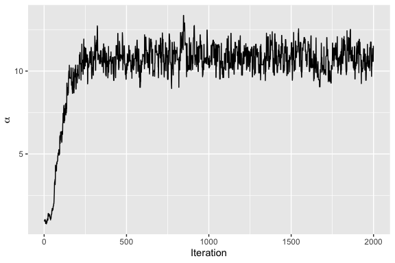
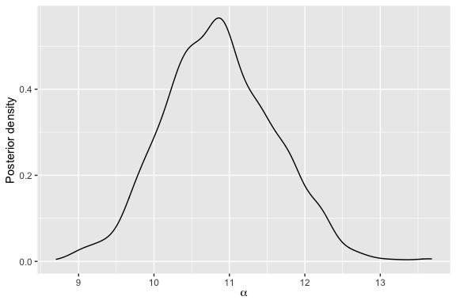

<!-- README.md is generated from README.Rmd. Please edit that file -->

# BayesMallows

[](https://cran.r-project.org/package=BayesMallows)
[](https://travis-ci.org/ocbe-uio/BayesMallows)
[](https://codecov.io/gh/ocbe-uio/BayesMallows)

This package provides a general framework for analyzing rank and
preference data based on the Bayesian Mallows model first described in
[Vitelli et al.(2018)](https://jmlr.org/papers/v18/15-481.html).

## Installation

To install the current release, use

``` r
install.packages("BayesMallows")
```

To install the current development version, use

``` r
#install.packages("remotes")
remotes::install_github("ocbe-uio/BayesMallows")

# Set build_vignettes to TRUE to also get the package vignette
remotes::install_github("ocbe-uio/BayesMallows", build_vignettes = TRUE)
```

## Basic Usage Example

To get started, load the package with

``` r
library(BayesMallows)
```

The package comes with several example datasets. The simplest one
contains 12 persons’ assessments of the weights of 20 potatoes, either
by visual inspection (`potato_visual`) or by lifting the potatoes and
comparing their relative weights by hand (`potato_weighing`). To fit a
Bayesian Mallows model on the `potato_visual` dataset, we do

``` r
fit <- compute_mallows(potato_visual)
```

Next, we can see a diagnostic plot for the Metropolis-Hastings algorithm
with `assess_convergence()`. The plot below is for the scale parameter,
which measures the variation between the individual rankings.

``` r
assess_convergence(fit)
```

<!-- -->

Setting the burnin to 500, we obtain a plot of the posterior
distribution of the scale parameter with:

``` r
plot(fit, burnin = 500)
```

<!-- -->

For more examples, please see the vignette, which is based on Sørensen
et al. (2020), and the function documentation. The vignette can be
opened by issuing the following command.

``` r
vignette("BayesMallows")
```

## The Bayesian Mallows Model

### Methodology

The BayesMallows package currently implements the complete model
described in Vitelli et al. (2018), which includes a large number of
distance metrics, handling of missing ranks and pairwise comparisons,
and clustering of users with similar preferences. The extension to
non-transitive pairwise comparisons by Crispino et al. (2019) is also
implemented. In addition, the partition function of the Mallows model
can be estimated using the importance sampling algorithm of Vitelli et
al. (2018) and the asymptotic approximation of Mukherjee (2016). For a
review of ranking models in general, see Q. Liu et al. (2019). Crispino
and Antoniano-Villalobos (2019) outlines how informative priors can be
used within the model.

### Applications

Among the current applications, Liu et al. (2019) applied the Bayesian
Mallows model for providing personalized recommendations based on
clicking data, and Barrett and Crispino (2018) used the model of
Crispino et al. (2019) to analyze listeners’ understanding of music.

### Future Extensions

Plans for future extensions of the package include allowing for analysis
of time-varying ranks as described in Asfaw et al. (2016), (frequentist)
maximum likelihood estimation, and implementation of a variational Bayes
algorithm for approximation the posterior distribution.

## Citation

If using the BayesMallows package in academic work, please cite Sørensen
et al. (2020), in addition to the relevant methodological papers.

``` r
citation("BayesMallows")
#> 
#> Sørensen Ø, Crispino M, Liu Q, Vitelli V (2020). "BayesMallows: An R
#> Package for the Bayesian Mallows Model." _R Journal_.
#> 
#> A BibTeX entry for LaTeX users is
#> 
#>   @Article{,
#>     author = {{\O}ystein S{\o}rensen and Marta Crispino and Qinghua Liu and Valeria Vitelli},
#>     title = {BayesMallows: An R Package for the Bayesian Mallows Model},
#>     journal = {R Journal},
#>     year = {2020},
#>   }
```

The paper is accepted for publication in the R Journal, and a link will
be posted here as soon as it appears online. It is identical to the
package vignette mentioned above.

## Contribution

This is an open source project, and all contributions are welcome. Feel
free to open an
[Issue](https://github.com/ocbe-uio/BayesMallows/issues), a [Pull
Request](https://github.com/ocbe-uio/BayesMallows/pulls), or to e-mail
us.

## References

<div id="refs" class="references hanging-indent">

<div id="ref-asfaw2016">

Asfaw, D., V. Vitelli, Ø Sørensen, E. Arjas, and A. Frigessi. 2016.
“Time-Varying Rankings with the Bayesian Mallows Model.” *Stat* 6 (1):
14–30. <https://doi.org/10.1002/sta4.132>.

</div>

<div id="ref-barrett2018">

Barrett, N., and M. Crispino. 2018. “The Impact of 3-d Sound
Spatialisation on Listeners’ Understanding of Human Agency in Acousmatic
Music.” *Journal of New Music Research* 47 (5): 399–415.
<https://doi.org/10.1080/09298215.2018.1437187>.

</div>

<div id="ref-crispino2019informative">

Crispino, M., and I. Antoniano-Villalobos. 2019. “Informative Extended
Mallows Priors in the Bayesian Mallows Model.”
<https://arxiv.org/abs/1901.10870>.

</div>

<div id="ref-crispino2019">

Crispino, M., E. Arjas, V. Vitelli, N. Barrett, and A. Frigessi. 2019.
“A Bayesian Mallows Approach to Nontransitive Pair Comparison Data:
How Human Are Sounds?” *The Annals of Applied Statistics* 13 (1):
492–519. <https://doi.org/10.1214/18-aoas1203>.

</div>

<div id="ref-liu2019">

Liu, Q, M Crispino, I Scheel, V Vitelli, and A Frigessi. 2019.
“Model-Based Learning from Preference Data.” *Annual Review of
Statistics and Its Application* 6 (1).
<https://doi.org/10.1146/annurev-statistics-031017-100213>.

</div>

<div id="ref-liu2019b">

Liu, Q., A. H. Reiner, A. Frigessi, and I. Scheel. 2019. “Diverse
Personalized Recommendations with Uncertainty from Implicit Preference
Data with the Bayesian Mallows Model.” *Knowledge-Based Systems* 186
(December): 104960. <https://doi.org/10.1016/j.knosys.2019.104960>.

</div>

<div id="ref-mukherjee2016">

Mukherjee, S. 2016. “Estimation in Exponential Families on
Permutations.” *The Annals of Statistics* 44 (2): 853–75.
<https://doi.org/10.1214/15-aos1389>.

</div>

<div id="ref-sorensen2020">

Sørensen, Ø, M. Crispino, Q. Liu, and V. Vitelli. 2020. “BayesMallows:
An R Package for the Bayesian Mallows Model.” *R Journal*.

</div>

<div id="ref-vitelli2018">

Vitelli, V., Ø. Sørensen, M. Crispino, E. Arjas, and A. Frigessi. 2018.
“Probabilistic Preference Learning with the Mallows Rank Model.”
*Journal of Machine Learning Research* 18 (1): 1–49.
<https://jmlr.org/papers/v18/15-481.html>.

</div>

</div>
