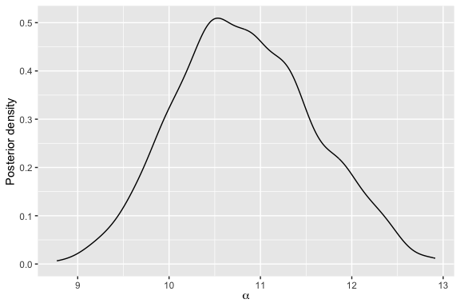

<!-- README.md is generated from README.Rmd. Please edit that file -->

# BayesMallows

[](https://cran.r-project.org/package=BayesMallows)
[](https://github.com/ocbe-uio/BayesMallows/actions)
[](https://app.codecov.io/gh/ocbe-uio/BayesMallows?branch=master)
[](https://www.codefactor.io/repository/github/ocbe-uio/bayesmallows/overview/master)

This package provides a general framework for analyzing rank and
preference data based on the Bayesian Mallows model.

## Installation

To install the current release, use

``` r
install.packages("BayesMallows")
```

To install the current development version, use

``` r
# install.packages("remotes")
remotes::install_github("ocbe-uio/BayesMallows")
```

## Basic Usage Example

To get started, load the package with

``` r
library(BayesMallows)
set.seed(123)
```

The package comes with several example datasets. The simplest one
contains 12 persons’ assessments of the weights of 20 potatoes, either
by visual inspection (`potato_visual`) or by lifting the potatoes and
comparing their relative weights by hand (`potato_weighing`).

### Metropolis-Hastings Algorithm

To fit a Bayesian Mallows model on the `potato_visual` dataset using the
Metropolis-Hastings algorithm first described in Vitelli et al.
([2018](#ref-vitelli2018)), we do

``` r
potato_data <- setup_rank_data(potato_visual)
fit <- compute_mallows(data = potato_data)
```

Next, we can see a diagnostic plot for the Metropolis-Hastings algorithm
with `assess_convergence()`. The plot below is for the scale parameter,
which measures the variation between the individual rankings.

``` r
assess_convergence(fit)
```

<!-- -->

Setting the burnin to 500, we obtain a plot of the posterior
distribution of the scale parameter with:

``` r
fit$burnin <- 500
plot(fit)
```

<!-- -->

For more examples, please see our [R Journal
paper](https://journal.r-project.org/archive/2020/RJ-2020-026/index.html),
and the function documentation. The use of parallel chains are described
in [this
vignette](https://ocbe-uio.github.io/BayesMallows/articles/parallel_chains.html).

### Sequential Monte Carlo Algorithm

The package also supports updating a Bayesian Mallows model using
sequential Monte Carlo, with the algorithm described in Stein
([2023](#ref-steinSequentialInferenceMallows2023)). For example, in
order to update the model fitted above with the potato ranks based on
comparing their relative weights by hand, we do

``` r
new_data <- setup_rank_data(rankings = potato_weighing)
updated_fit <- update_mallows(model = fit, new_data = new_data)
```

We can go on to plot the posterior distribution of the scale parameter
for this updated model.

``` r
plot(updated_fit)
```

<!-- -->

Sequential Monte Carlo can typically be useful when new data arrives in
batches, as it does not require the Metropolis-Hastings algorithm to be
rerun. See [this
vignette](https://ocbe-uio.github.io/BayesMallows/articles/SMC-Mallows.html)
for more information.

## The Bayesian Mallows Model

### Methodology

The BayesMallows package currently implements the complete model
described in Vitelli et al. ([2018](#ref-vitelli2018)), which includes a
large number of distance metrics, handling of missing ranks and pairwise
comparisons, and clustering of users with similar preferences. The
extension to non-transitive pairwise comparisons by Crispino et al.
([2019](#ref-crispino2019)) is also implemented. In addition, the
partition function of the Mallows model can be estimated using the
importance sampling algorithm of Vitelli et al.
([2018](#ref-vitelli2018)) and the asymptotic approximation of Mukherjee
([2016](#ref-mukherjee2016)). For a review of ranking models in general,
see Liu, Crispino, et al. ([2019](#ref-liu2019)). Crispino and
Antoniano-Villalobos ([2022](#ref-crispino2022)) outlines how
informative priors can be used within the model.

Updating of the posterior distribution based on new data, using
sequential Monte Carlo methods, is implemented and described in [a
separate
vignette](https://ocbe-uio.github.io/BayesMallows/articles/SMC-Mallows.html).
The computational algorithms are described in further detail in Stein
([2023](#ref-steinSequentialInferenceMallows2023)).

### Applications

Among the current applications, Liu, Reiner, et al.
([2019](#ref-liu2019b)) applied the Bayesian Mallows model for providing
personalized recommendations based on clicking data, and Barrett and
Crispino ([2018](#ref-barrett2018)) used the model of Crispino et al.
([2019](#ref-crispino2019)) to analyze listeners’ understanding of
music. Eliseussen, Fleischer, and Vitelli
([2022](#ref-eliseussenRankbasedBayesianVariable2022)) presented an
extended model for variable selection in genome-wide transcriptomic
analyses.

### Future Extensions

Plans for future extensions of the package include implementation of a
variational Bayes algorithm for approximation the posterior
distribution. The sequential Monte Carlo algorithms will also be
extended to cover a larger part of the model framework, and we will add
more options for specifications of prior distributions.

## Citation

If using the BayesMallows package in academic work, please cite Sørensen
et al. ([2020](#ref-sorensen2020)), in addition to the relevant
methodological papers.

``` r
citation("BayesMallows")
#> To cite package 'BayesMallows' in publications use:
#> 
#>   Sørensen Ø, Crispino M, Liu Q, Vitelli V (2020). "BayesMallows: An R
#>   Package for the Bayesian Mallows Model." _The R Journal_, *12*(1),
#>   324-342. doi:10.32614/RJ-2020-026
#>   <https://doi.org/10.32614/RJ-2020-026>.
#> 
#> A BibTeX entry for LaTeX users is
#> 
#>   @Article{,
#>     author = {{\O}ystein S{\o}rensen and Marta Crispino and Qinghua Liu and Valeria Vitelli},
#>     doi = {10.32614/RJ-2020-026},
#>     title = {BayesMallows: An R Package for the Bayesian Mallows Model},
#>     journal = {The R Journal},
#>     number = {1},
#>     pages = {324--342},
#>     volume = {12},
#>     year = {2020},
#>   }
```

## Contribution

This is an open source project, and all contributions are welcome. Feel
free to open an
[Issue](https://github.com/ocbe-uio/BayesMallows/issues), a [Pull
Request](https://github.com/ocbe-uio/BayesMallows/pulls), or to e-mail
us.

## References

<div id="refs" class="references csl-bib-body hanging-indent">

<div id="ref-barrett2018" class="csl-entry">

Barrett, N., and Marta Crispino. 2018. “The Impact of 3-d Sound
Spatialisation on Listeners’ Understanding of Human Agency in Acousmatic
Music.” *Journal of New Music Research* 47 (5): 399–415.
<https://doi.org/10.1080/09298215.2018.1437187>.

</div>

<div id="ref-crispino2022" class="csl-entry">

Crispino, Marta, and Isadora Antoniano-Villalobos. 2022. “Informative
Priors for the Consensus Ranking in the Bayesian Mallows Model.”
*Bayesian Analysis*, January, 1–24. <https://doi.org/10.1214/22-BA1307>.

</div>

<div id="ref-crispino2019" class="csl-entry">

Crispino, Marta, E. Arjas, V. Vitelli, N. Barrett, and A. Frigessi.
2019. “A Bayesian Mallows Approach to Nontransitive Pair Comparison
Data: How Human Are Sounds?” *The Annals of Applied Statistics* 13 (1):
492–519. <https://doi.org/10.1214/18-aoas1203>.

</div>

<div id="ref-eliseussenRankbasedBayesianVariable2022" class="csl-entry">

Eliseussen, Emilie, Thomas Fleischer, and Valeria Vitelli. 2022.
“Rank-Based Bayesian Variable Selection for Genome-Wide Transcriptomic
Analyses.” *Statistics in Medicine* 41 (23): 4532–53.
<https://doi.org/10.1002/sim.9524>.

</div>

<div id="ref-liu2019" class="csl-entry">

Liu, Q., Marta Crispino, I. Scheel, V. Vitelli, and A. Frigessi. 2019.
“Model-Based Learning from Preference Data.” *Annual Review of
Statistics and Its Application* 6 (1).
<https://doi.org/10.1146/annurev-statistics-031017-100213>.

</div>

<div id="ref-liu2019b" class="csl-entry">

Liu, Q., A. H. Reiner, A. Frigessi, and I. Scheel. 2019. “Diverse
Personalized Recommendations with Uncertainty from Implicit Preference
Data with the Bayesian Mallows Model.” *Knowledge-Based Systems* 186
(December): 104960. <https://doi.org/10.1016/j.knosys.2019.104960>.

</div>

<div id="ref-mukherjee2016" class="csl-entry">

Mukherjee, S. 2016. “Estimation in Exponential Families on
Permutations.” *The Annals of Statistics* 44 (2): 853–75.
<https://doi.org/10.1214/15-aos1389>.

</div>

<div id="ref-sorensen2020" class="csl-entry">

Sørensen, Øystein, Marta Crispino, Qinghua Liu, and Valeria Vitelli.
2020. “BayesMallows: An R Package for the Bayesian Mallows Model.” *The
R Journal* 12 (1): 324–42. <https://doi.org/10.32614/RJ-2020-026>.

</div>

<div id="ref-steinSequentialInferenceMallows2023" class="csl-entry">

Stein, Anja. 2023. “Sequential Inference with the Mallows Model.” PhD
thesis, Lancaster University.

</div>

<div id="ref-vitelli2018" class="csl-entry">

Vitelli, V., Ø. Sørensen, M. Crispino, E. Arjas, and A. Frigessi. 2018.
“Probabilistic Preference Learning with the Mallows Rank Model.”
*Journal of Machine Learning Research* 18 (1): 1–49.
<https://jmlr.org/papers/v18/15-481.html>.

</div>

</div>
