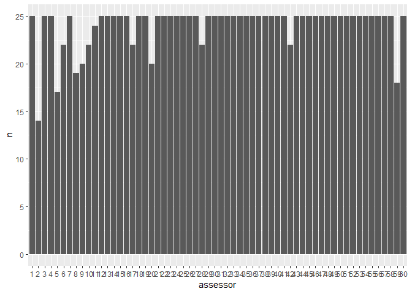
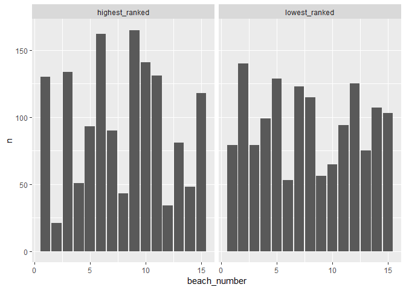

Beach Data
================

This is a very short exploration of the beach data, to see if I
understand them. First I load them.

``` r
load("../data-raw/Beaches_data.Rdata")
```

Then I take a look at the objects in
    it:

``` r
ls()
```

    ## [1] "B2"          "constrained" "data"        "draws"       "ranking"

After exploring them a little bit, it seems like `data` contains the raw
data:

``` r
knitr::kable(head(data))
```

| assessors | firstItem | secondItem | results |
| :-------- | :-------- | :--------- | :------ |
| 1         | B2        | B15        | 2       |
| 1         | B5        | B3         | 2       |
| 1         | B13       | B3         | 2       |
| 1         | B4        | B7         | 2       |
| 1         | B5        | B15        | 2       |
| 1         | B12       | B6         | 2       |

**Question**: What does the `results` column represent?

I convert it to a dataframe and only use the integer indices of the
beaches:

``` r
library(dplyr)
library(ggplot2)
library(tidyr)

beach_data <- as_tibble(data) %>% 
  transmute(
    assessor = as.factor(as.integer(assessors)),
    lowest_ranked = as.integer(gsub("[[:alpha:]]", "", firstItem)),
    highest_ranked = as.integer(gsub("[[:alpha:]]", "", secondItem))
  )

knitr::kable(head(beach_data, 6))
```

| assessor | lowest\_ranked | highest\_ranked |
| :------- | -------------: | --------------: |
| 1        |              2 |              15 |
| 1        |              5 |               3 |
| 1        |             13 |               3 |
| 1        |              4 |               7 |
| 1        |              5 |              15 |
| 1        |             12 |               6 |

**Questions**: Is `firstItem` the non-preferred beach? I assumed that in
the conversion above, based on comparing the summary statistics to the
results in the paper.

I now compute some summary statistics. First, the number of assessors:

``` r
beach_data %>% summarise(n_distinct(assessor)) %>% pull()
```

    ## [1] 60

Next, the number of comparisons per assessor. Most have ranked 25 items,
but some have ranked fewer.

``` r
beach_data %>% 
  group_by(assessor) %>% 
  count() %>% 
  ggplot(aes(x = assessor, y = n)) + geom_col()
```

<!-- -->

Finally, I compute the average number of times each beach is preferred
or not preferred.

``` r
beach_summary <- beach_data %>% 
  gather(key = "type", value = "beach_number", -assessor) %>% 
  group_by(type, beach_number) %>% 
  count()

knitr::kable(head(beach_summary, 6))
```

| type            | beach\_number |   n |
| :-------------- | ------------: | --: |
| highest\_ranked |             1 | 130 |
| highest\_ranked |             2 |  21 |
| highest\_ranked |             3 | 134 |
| highest\_ranked |             4 |  51 |
| highest\_ranked |             5 |  93 |
| highest\_ranked |             6 | 162 |

We plot the number of times each beach is highest or lowest ranked:

``` r
ggplot(beach_summary, aes(x = beach_number, y = n)) +
  geom_col() +
  facet_wrap(~ type)
```

<!-- -->

The left plot shows that beach 9 is most often highest ranked, beach 6
second most often. These are also beach 1 and 2 in the posterior
summaries in Table 6 of the JMLR paper. Next, beach 2 is most often
lowest ranked, which is in agreement with it being at the bottom of
Table 6.
