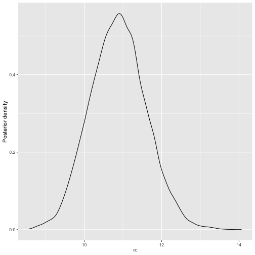
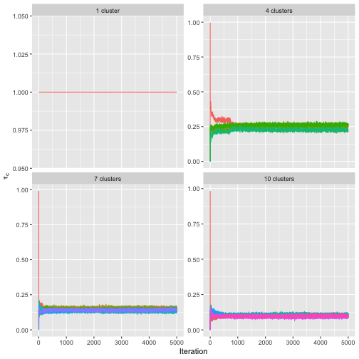
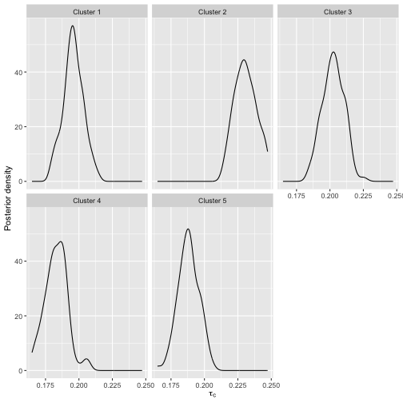

This vignette contains update syntax for the code examples in @sorensen2020, since both the underlying code and the user interface are continuously evolving. We refer to @sorensen2020 for notation and all other details about the models and algorithms.


```r
library(BayesMallows)
```


# Analysis of complete rankings

We illustrate the case of complete rankings with the potato datasets described in Section 4 of [@liu2019]. In short, a bag of 20 potatoes was bought, and 12 assessors were asked to rank the potatoes by weight, first by visual inspection, and next by holding the potatoes in hand. These datasets are available in `BayesMallows` as matrices with names `potato_weighing` and `potato_visual`, respectively. The true ranking of the potatoes' weights is available in the vector `potato_true_ranking`. In general, `compute_mallows` expects ranking datasets to have one row for each assessor and one column for each item. Each row has to be a proper permutation, possibly with missing values. We are interested in the posterior distribution of both the level of agreement between assessors, as described by $\alpha$, and in the latent ranking of the potatoes, as described by $\boldsymbol{\rho}$. We refer to the attached replication script for random number seeds for exact reproducibility. 

We start by defining our data object, which in this case consists of complete rankings.


```r
complete_data <- setup_rank_data(rankings = potato_visual)
```

First, we do a test run to check convergence of the MCMC algorithm, and then get trace plots with `assess_convergence`.


```r
bmm_test <- compute_mallows(data = complete_data)
assess_convergence(bmm_test)
```


By default, `assess_convergence` returns a trace plot for $\alpha$, shown in the figure above. The algorithm seems to be mixing well after around 500 iterations. Next, we study the convergence of $\mathbf{\rho}$. To avoid overly complex plots, we pick potatoes $1-5$ by specifying this in the `items` argument.


```r
assess_convergence(bmm_test, parameter = "rho", items = 1:5)
```


The plot shows that the MCMC algorithm seems to have converged after around 1,000 iterations.

From the trace plots, we decide to discard the first 1,000 MCMC samples as burn-in. We rerun the algorithm to get 20,000 samples after burn-in. The object `bmm_visual` has `S3` class `BayesMallows`, so we plot the posterior distribution of $\alpha$ with `plot.BayesMallows`.


```r
bmm_visual <- compute_mallows(
  data = complete_data, 
  compute_options = set_compute_options(nmc = 21000, burnin = 1000)
  )
plot(bmm_visual)
```



We can also get posterior credible intervals for $\alpha$ using `compute_posterior_intervals`, which returns both highest posterior density intervals (HPDI) and central intervals in a `data.frame`. 


```r
compute_posterior_intervals(bmm_visual, decimals = 1L)
#>   parameter mean median conf_level       hpdi central_interval
#> 1     alpha   10   10.8       95 % [0.0,12.1]       [0.0,12.3]
```

Next, we can go on to study the posterior distribution of $\boldsymbol{\rho}$. If the \code{items} argument is not provided, and the number of items exceeds five, five items are picked at random for plotting. To show all potatoes, we explicitly set \code{items = 1:20}.


```r
plot(bmm_visual, parameter = "rho", items = 1:20)
```


## Jumping over the scale parameter

Updating $\alpha$ in every step of the MCMC algorithm may not be necessary, as the number of posterior samples typically is more than large enough to obtain good estimates of its posterior distribution. With the `alpha_jump` argument, we can tell the MCMC algorithm to update $\alpha$ only every `alpha_jump`-th iteration. To update $\alpha$ every 10th time $\boldsymbol{\rho}$ is updated, we do


```r
bmm_visual <- compute_mallows(
  data = complete_data, 
  compute_options = 
    set_compute_options(nmc = 21000, burnin = 1000, alpha_jump = 10)
  )
```

## Other distance metric

By default, `compute_mallows` uses the footrule distance, but the user can also choose to use Cayley, Kendall, Hamming, Spearman, or Ulam distance. Running the same analysis of the potato data with Spearman distance is done with the command


```r
bmm <- compute_mallows(
  data = complete_data, 
  model = set_model_options(metric = "spearman"),
  compute_options = set_compute_options(nmc = 21000, burnin = 1000)
)
```


For the particular case of Spearman distance, `BayesMallows` only has integer sequences for computing the exact partition function with 14 or fewer items. In this case a precomputed importance sampling estimate is part of the package, and used instead.

# Analysis of preference data

Unless the argument `error_model` to `set_model_options` is set, pairwise preference data are assumed to be consistent within each assessor. These data should be provided in a dataframe with the following three columns, with one row per pairwise comparison:

* `assessor` is an identifier for the assessor; either a numeric vector containing the assessor index, or a character vector containing the unique name of the assessor.
* `bottom_item` is a numeric vector containing the index of the item that was disfavored in each pairwise comparison.
* `top_item` is a numeric vector containing the index of the item that was preferred in each pairwise comparison.


A dataframe with this structure can be given in the `preferences` argument to `setup_rank_data`, which will generate the full set of implied rankings for each assessor as well as an initial ranking matrix consistent with the pairwise preferences.

We illustrate with the beach preference data containing stated pairwise preferences between random subsets of 15 images of beaches, by 60 assessors [@vitelli2018]. This dataset is provided in the dataframe `beach_preferences`, whose first six rows are shown below:


```r
head(beach_preferences)
#>   assessor bottom_item top_item
#> 1        1           2       15
#> 2        1           5        3
#> 3        1          13        3
#> 4        1           4        7
#> 5        1           5       15
#> 6        1          12        6
```

We can define a rank data object based on these preferences.


```r
beach_data <- setup_rank_data(preferences = beach_preferences)
```

It is instructive to compare the computed transitive closure to the stated preferences. Let's do this for all preferences stated by assessor 1 involving beach 2. We first look at the raw preferences.


```r
subset(beach_preferences, assessor == 1 & (bottom_item == 2 | top_item == 2))
#>   assessor bottom_item top_item
#> 1        1           2       15
```

We then use the function `get_transitive_closure` to obtain the transitive closure, and then focus on the same subset:


```r
tc <- get_transitive_closure(beach_data)
subset(tc, assessor == 1 & (bottom_item == 2 | top_item == 2))
#>    assessor bottom_item top_item
#> 11        1           2        6
#> 44        1           2       15
```

Assessor 1 has performed only one direct comparison involving beach 2, in which the assessor stated that beach 15 is preferred to beach 2. The implied orderings, on the other hand, contain two preferences involving beach 2. In addition to the statement that beach 15 is preferred to beach 2, all the other orderings stated by assessor 1 imply that this assessor prefers beach 6 to beach 2.


## Convergence diagnostics

As with the potato data, we can do a test run to assess the convergence of the MCMC algorithm. This time we use the `beach_data` object that we generated above, based on the stated preferences. We also set \code{save\_aug = TRUE} to save the augmented rankings in each MCMC step, hence letting us assess the convergence of the augmented rankings.


```r
bmm_test <- compute_mallows(
  data = beach_data,
  compute_options = set_compute_options(save_aug = TRUE))
```

Running `assess_convergence` for $\alpha$ and $\boldsymbol{\rho}$ shows good convergence after 1000 iterations.


```r
assess_convergence(bmm_test)
```


```r
assess_convergence(bmm_test, parameter = "rho", items = 1:6)
```


To check the convergence of the data augmentation scheme, we need to set `parameter = "Rtilde"`, and also specify which items and assessors to plot. Let us start by considering items 2, 6, and 15 for assessor 1, which we studied above.


```r
assess_convergence(
  bmm_test, parameter = "Rtilde", items = c(2, 6, 15), assessors = 1)
```


The convergence plot illustrates how the augmented rankings vary, while also obeying their implied ordering.

By further investigation of the transitive closure, we find that no orderings are implied between beach 1 and beach 15 for assessor 2. That is, the following statement returns zero rows.


```r
subset(tc, assessor == 2 & bottom_item %in% c(1, 15) & top_item %in% c(1, 15))
#> [1] assessor    bottom_item top_item   
#> <0 rows> (or 0-length row.names)
```


With the following command, we create trace plots to confirm this:


```r
assess_convergence(
  bmm_test, parameter = "Rtilde", items = c(1, 15), assessors = 2)
```


As expected, the traces of the augmented rankings for beach 1 and 15 for assessor 2 do cross each other, since no ordering is implied between them.

Ideally, we should look at trace plots for augmented ranks for more assessors to be sure that the algorithm is close to convergence. We can plot assessors 1-8 by setting `assessors = 1:8`. We also quite arbitrarily pick items 13-15, but the same procedure can be repeated for other items.


```r
assess_convergence(
  bmm_test, parameter = "Rtilde", items = 13:15, assessors = 1:8)
```


The plot indicates good mixing.

## Posterior distributions

Based on the convergence diagnostics, and being fairly conservative, we discard the first 2,000 MCMC iterations as burn-in, and take 20,000 additional samples.


```r
bmm_beaches <- compute_mallows(
  data = beach_data,
  compute_options = 
    set_compute_options(nmc = 22000, burnin = 2000, save_aug = TRUE)
)
```


The posterior distributions of $\alpha$ and $\boldsymbol{\rho}$ can be studied as shown in the previous sections. Posterior intervals for the latent rankings of each beach are obtained with `compute_posterior_intervals`:


```r
compute_posterior_intervals(bmm_beaches, parameter = "rho")
#>       item parameter mean median conf_level    hpdi central_interval
#> 1   Item 1       rho    7      7       95 %     [7]            [6,7]
#> 2   Item 2       rho   15     15       95 %    [15]          [14,15]
#> 3   Item 3       rho    3      3       95 %   [3,4]            [3,4]
#> 4   Item 4       rho   12     12       95 % [11,13]          [11,14]
#> 5   Item 5       rho    9      9       95 %  [8,10]           [8,10]
#> 6   Item 6       rho    2      2       95 %   [1,2]            [1,2]
#> 7   Item 7       rho    9      9       95 %  [8,10]           [8,10]
#> 8   Item 8       rho   12     11       95 % [11,13]          [11,13]
#> 9   Item 9       rho    1      1       95 %   [1,2]            [1,2]
#> 10 Item 10       rho    6      6       95 %   [6,7]            [6,7]
#> 11 Item 11       rho    4      4       95 %   [3,5]            [3,5]
#> 12 Item 12       rho   13     13       95 % [12,14]          [12,14]
#> 13 Item 13       rho   10     10       95 %  [8,10]           [8,10]
#> 14 Item 14       rho   13     14       95 % [11,14]          [11,14]
#> 15 Item 15       rho    5      5       95 %   [4,5]            [4,5]
```


We can also rank the beaches according to their cumulative probability (CP) consensus [@vitelli2018] and their maximum posterior (MAP) rankings. This is done with the function `compute_consensus`, and the following call returns the CP consensus:


```r
compute_consensus(bmm_beaches, type = "CP")
#>    ranking    item cumprob
#> 1        1  Item 9 0.88015
#> 2        2  Item 6 1.00000
#> 3        3  Item 3 0.66325
#> 4        4 Item 11 0.94100
#> 5        5 Item 15 0.97925
#> 6        6 Item 10 0.95695
#> 7        7  Item 1 1.00000
#> 8        8  Item 7 0.48825
#> 9        9  Item 5 0.92460
#> 10      10 Item 13 0.99545
#> 11      11  Item 8 0.50680
#> 12      12  Item 4 0.80070
#> 13      13 Item 12 0.68850
#> 14      14 Item 14 0.98530
#> 15      15  Item 2 1.00000
```

The column `cumprob` shows the probability of having the given rank or lower. Looking at the second row, for example, this means that beach 6 has probability 1 of having latent rank $\rho_{6} \leq 2$. Next, beach 3 has probability 0.738 of having latent rank $\rho_{3}\leq 3$. This is an example of how the Bayesian framework can be used to not only rank items, but also to give posterior assessments of the uncertainty of the rankings. The MAP consensus is obtained similarly, by setting `type = "MAP"`.


```r
compute_consensus(bmm_beaches, type = "MAP")
#>    map_ranking    item probability
#> 1            1  Item 9     0.05315
#> 2            2  Item 6     0.05315
#> 3            3  Item 3     0.05315
#> 4            4 Item 11     0.05315
#> 5            5 Item 15     0.05315
#> 6            6 Item 10     0.05315
#> 7            7  Item 1     0.05315
#> 8            8  Item 7     0.05315
#> 9            9  Item 5     0.05315
#> 10          10 Item 13     0.05315
#> 11          11  Item 4     0.05315
#> 12          12  Item 8     0.05315
#> 13          13 Item 12     0.05315
#> 14          14 Item 14     0.05315
#> 15          15  Item 2     0.05315
```


Keeping in mind that the ranking of beaches is based on sparse pairwise preferences, we can also ask: for beach $i$, what is the probability of being ranked top-$k$ by assessor $j$, and what is the probability of having latent rank among the top-$k$. The function `plot_top_k` plots these probabilities. By default, it sets `k = 3`, so a heatplot of the probability of being ranked top-3 is obtained with the call:


```r
plot_top_k(bmm_beaches)
```


The left part of the plot shows the beaches ranked according to their CP consensus, and the probability $P\left(\rho_{i} \leq 3 \right)$ for each beach $i$. The right part of the plot shows, for each beach as indicated on the left axis, the probability that assessor $j$ ranks the beach among top-3. For example, we see that assessor 1 has a very low probability of ranking beach 9 among her top-3, while assessor 3 has a very high probability of doing this.

The function `predict_top_k` returns a dataframe with all the underlying probabilities. For example, in order to find all the beaches that are among the top-3 of assessors 1-5 with more than 90 \% probability, we would do:


```r
subset(predict_top_k(bmm_beaches), prob > .9 & assessor %in% 1:5)
#>     assessor    item    prob
#> 121        1 Item 11 0.94890
#> 661        1  Item 6 0.99275
#> 663        3  Item 6 0.99445
#> 843        3  Item 9 1.00000
#> 844        4  Item 9 1.00000
#> 665        5  Item 6 0.97740
```

Note that assessor 2 does not appear in this table, i.e., there are no beaches for which we are at least 90 \% certain that the beach is among assessor 2's top-3.

# Clustering

`BayesMallows` comes with a set of sushi preference data, in which 5,000 assessors each have ranked a set of 10 types of sushi [@kamishima2003]. It is interesting to see if we can find subsets of assessors with similar preferences. The sushi dataset was analyzed with the BMM by @vitelli2018, but the results in that paper differ somewhat from those obtained here, due to a bug in the function that was used to sample cluster probabilities from the Dirichlet distribution. We start by defining the data object.


```r
sushi_data <- setup_rank_data(sushi_rankings)
```


## Convergence diagnostics

The function `compute_mallows_mixtures` computes multiple Mallows models with different numbers of mixture components. It returns a list of models of class `BayesMallowsMixtures`, in which each list element contains a model with a given number of mixture components. Its arguments are `n_clusters`, which specifies the number of mixture components to compute, an optional parameter `cl` which can be set to the return value of the `makeCluster` function in the `parallel` package, and an ellipsis (`...`) for passing on arguments to `compute_mallows`.

Hypothesizing that we may not need more than 10 clusters to find a useful partitioning of the assessors, we start by doing test runs with 1, 4, 7, and 10 mixture components in order to assess convergence. We set the number of Monte Carlo samples to 5,000, and since this is a test run, we do not save within-cluster distances from each MCMC iteration and hence set `include_wcd = FALSE`.


```r
library("parallel")
cl <- makeCluster(detectCores())
bmm <- compute_mallows_mixtures(
  n_clusters = c(1, 4, 7, 10),
  data = sushi_data,
  compute_options = set_compute_options(nmc = 5000, include_wcd = FALSE),
  cl = cl)
stopCluster(cl)
```

The function `assess_convergence` automatically creates a grid plot when given an object of class `BayesMallowsMixtures`, so we can check the convergence of $\alpha$ with the command


```r
assess_convergence(bmm)
```


The resulting plot shows that all the chains seem to be close to convergence quite quickly. We can also make sure that the posterior distributions of the cluster probabilities $\tau_{c}$, $(c = 1, \dots, C)$ have converged properly, by setting `parameter = "cluster_probs"`. 


```r
assess_convergence(bmm, parameter = "cluster_probs")
```



Note that with only one cluster, the cluster probability is fixed at the value 1, while for other number of mixture components, the chains seem to be mixing well.

## Deciding on the number of mixture components

Given the convergence assessment of the previous section, we are fairly confident that a burn-in of 1,000 is sufficient. We run 40,000 additional iterations, and try from 1 to 10 mixture components. Our goal is now to determine the number of mixture components to use, and in order to create an elbow plot, we set `include_wcd = TRUE` to compute the within-cluster distances in each step of the MCMC algorithm. Since the posterior distributions of $\rho_{c}$ ($c = 1,\dots,C$) are highly peaked, we save some memory by only saving every 10th value of $\boldsymbol{\rho}$ by setting `rho_thinning = 10`.


```r
cl <- makeCluster(detectCores())
bmm <- compute_mallows_mixtures(
  n_clusters = 1:10, 
  data = sushi_data,
  compute_options = 
    set_compute_options(nmc = 11000, burnin = 1000,
                        rho_thinning = 10, include_wcd = TRUE),
  cl = cl)
stopCluster(cl)
```

We then create an elbow plot:


```r
plot_elbow(bmm)
```


Although not clear-cut, we see that the within-cluster sum of distances levels off at around 5 clusters, and hence we choose to use 5 clusters in our model.

## Posterior distributions

Having chosen 5 mixture components, we go on to fit a final model, still running 10,000 iterations after burnin. This time we call `compute_mallows` and set `n_clusters = 5`. We also set `clus_thinning = 10` to save the cluster assignments of each assessor in every 10th iteration, and `rho_thinning = 10` to save the estimated latent rank every 10th iteration. Note that thinning is done only for because saving the values at every iteration would result in very large objects being stored in memory, thus slowing down computation. For statistical efficiency, it is best to avoid thinning.


```r
bmm <- compute_mallows(
  data = sushi_data,
  model = set_model_options(n_cluster = 5),
  compute_options = set_compute_options(
    nmc = 11000, burnin = 1000, clus_thinning = 10, rho_thinning = 10)
)
```

We can plot the posterior distributions of $\alpha$ and $\bm{\rho}$ in each cluster using `plot.BayesMallows` as shown previously for the potato data. 


```r
plot(bmm)
```


Since there are five clusters, the easiest way of visualizing posterior rankings is by choosing a single item.


```r
plot(bmm, parameter = "rho", items = 1)
```


We can also show the posterior distributions of the cluster probabilities.


```r
plot(bmm, parameter = "cluster_probs")
```



Using the argument `parameter = "cluster_assignment"`, we can visualize the posterior probability for each assessor of belonging to each cluster:


```r
plot(bmm, parameter = "cluster_assignment")
```


The number underlying the plot can be found using `assign_cluster`.

We can find clusterwise consensus rankings using `compute_consensus`.


