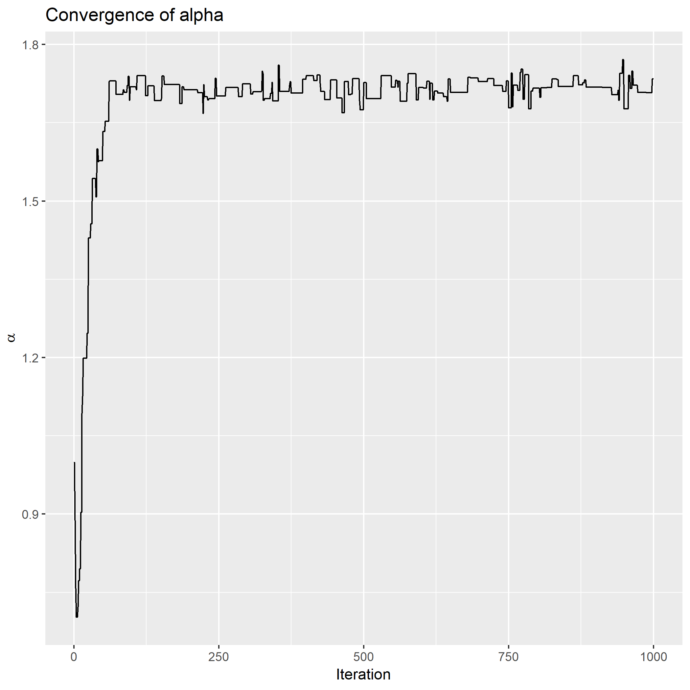
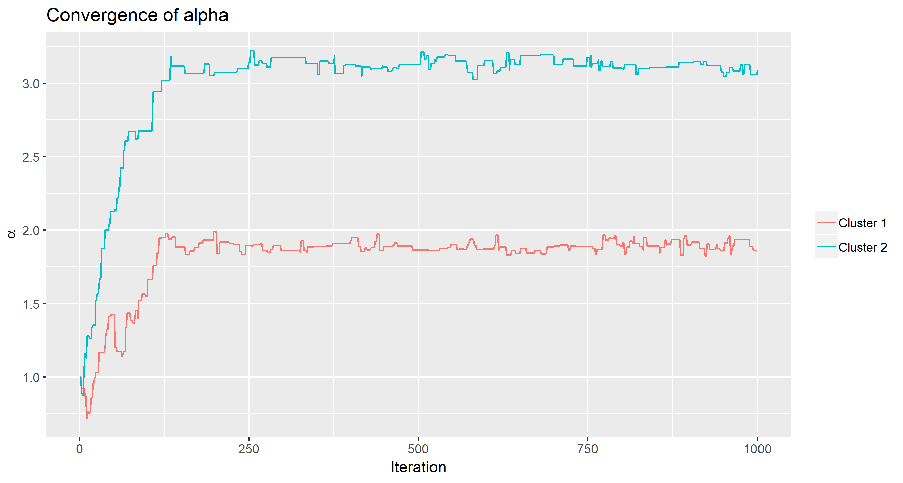
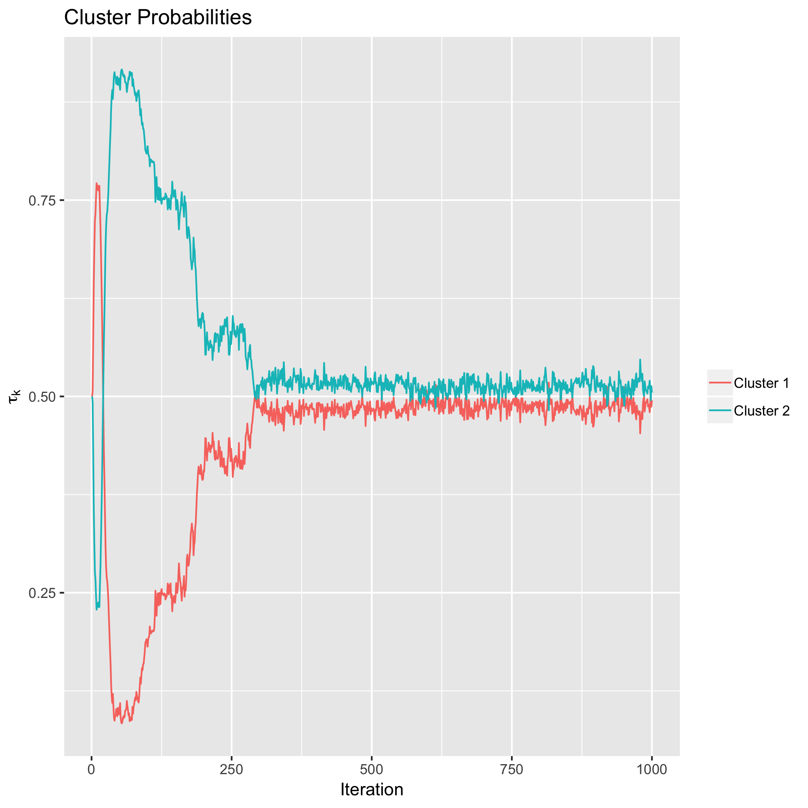
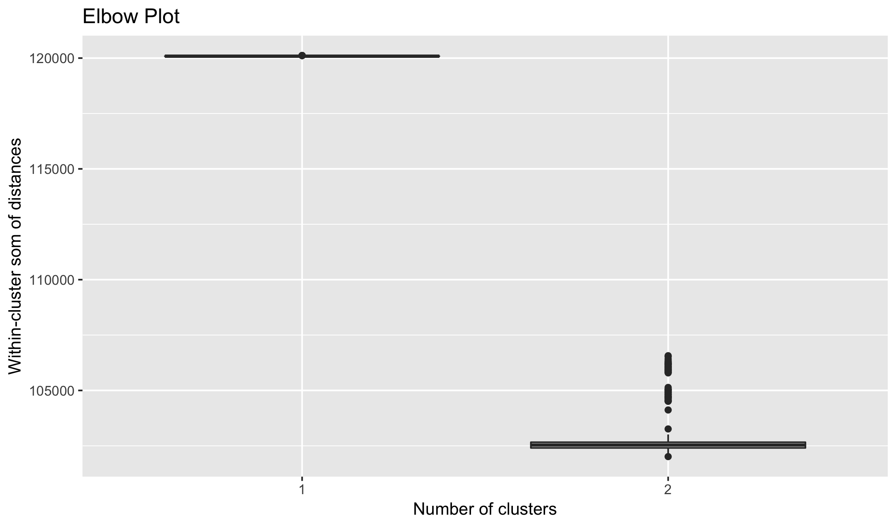
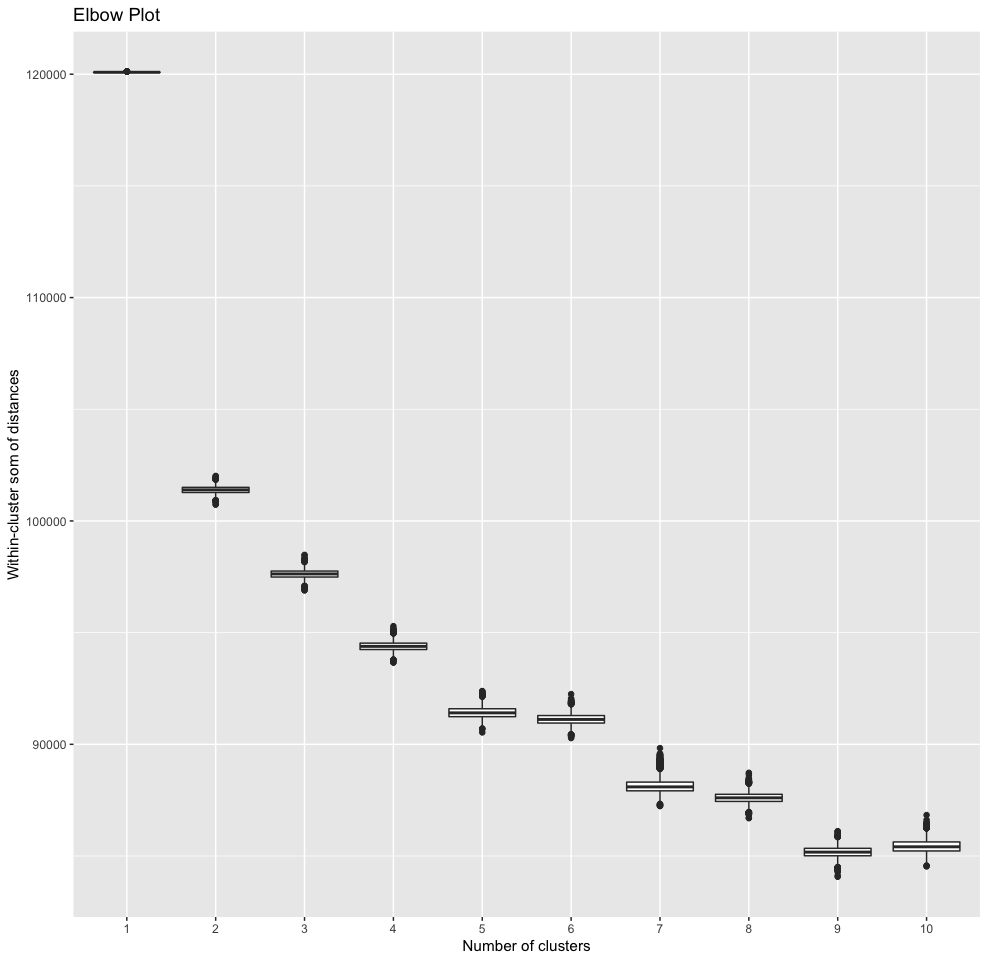
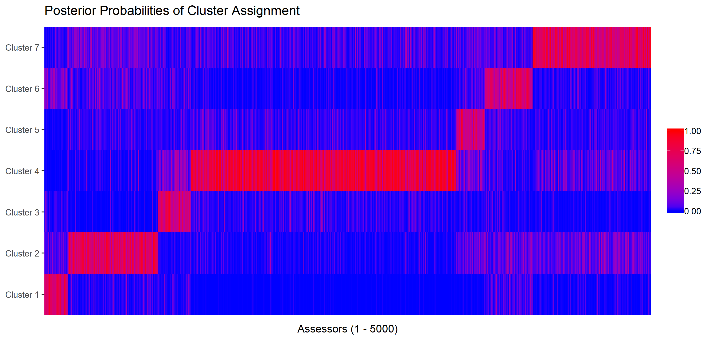

```{r setup, include = FALSE}
knitr::opts_chunk$set(
  collapse = TRUE,
  comment = "#>"
)
set.seed(232312)
```

The `BayesMallows` package implements methods for Bayesian preference learning with the Mallows rank model, as originally described in @vitelli2018, and further developed in @asfaw2016 and @crispino2018. This vignette describes the usage of the package, starting from the complete data cases, through top-$k$ rankings, pairwise comparisons, and finally clustering. We refer to the above mentioned papers, as well as the review @liu2018 for a thorough description of the methods. The necessary methods for data preprocessing, tuning of algorithms, and assessment of the posterior distributions will be described along the way.

[The package's GitHub repository](https://github.uio.no/oyss/BayesMallows) describes how to install it. We start this vignette by loading it.

```{r, message=FALSE}
library(BayesMallows)
```

We also load the `dplyr` package, which we will use a few places.

```{r, message=FALSE}
library(dplyr)
```

# Overview of Functions

Here is an overview of the most used function. You can read their documentation with `?function_name`, or search for an example in this vignette.

----------------------------- ------------------------------------------------------
Function Name                 Description
----------------------------- ------------------------------------------------------
`compute_mallows`             Compute the posterior distribution of the Bayesian Mallows model. This is the main function of the package. Returns an object of class `BayesMallows`.

`plot.BayesMallows`           Quick plots of the posterior densities of $\alpha$ and $\rho$.

 `assess_convergence`         Study the convergence of the Markov chain, in order to determine burnin and other algorithm parameters.  
 
 `plot_elbow`                 Create an elbow plot for comparing models with different number of clusters. 
 
 `plot_top_k`                 Plot the top-$k$ rankings. Particularly relevant when the data is in the form of pairwise comparisons. 
 
 `assign_cluster`             Compute the cluster assignment of assessors.
 
 `compute_cp_consensus`       Rank the items according to their CP consensus. 
 
 `compute_posterior_intervals` Compute Bayesian posterior intervals for the parameters. 
 
 `generate_initial_ranking`    Generate an initial ranking, for the case of missing data or pairwise comparisons. 
 
 `generate_transitive_closure` Generate the transitive closure for a set of pairwise comparisons. 
------------------- --------------------------------------------------

: Main functions in the `BayesMallows` package.


# Completely Ranked Data

## Potato Data
`BayesMallows` comes with example data described in @liu2018. A total of 12 assessors were asked to rank 20 potatoes based on their weight. In the first round, the assessors were only allowed to study the potatoes visually, while in the second round, the assessors were also allowed to hold the potatoes in their hands in order to compare them. The data sets are named `potato_visual` and `potato_weighing`, respectively. The true ordering of the potatoes' weights are stored in the vector `potato_true_ranking`.

The `potato_visual` dataset is shown below. The column names P1, ..., P20 represent potatoes, and the row names A1, ..., A12 represent assessors. The `potato_weighing` dataset has a similar structure.

```{r, echo=FALSE, results='asis'}
knitr::kable(potato_visual, caption = "Example dataset `potato_visual`.")
```

## Algorithm Tuning

The `compute_mallows` function is the workhorse of `BayesMallows`. It runs the Metropolis-Hastings algorithm and returns the posterior distribution of the scale parameter $\alpha$ and the latent ranks $\rho$ of the Mallows model. To see all its arguments, please run `?compute_mallows` in the console.

We start by using all the default values of the parameters, so we only need to supply the matrix of ranked items. We use the `potato_visual` data printed above. 

```{r}
model_fit <- compute_mallows(potato_visual)
```

The argument returned is a list object of class `BayesMallows`, which contains a whole lot of information about the MCMC run.

```{r}
class(model_fit)
names(model_fit)
```

The function `assess_convergence` produces plots for visual convergence assessment. We start by studing $\alpha$, which is the default. The plot is shown below, and looks good enough, at least to begin with.

```{r, fig.width=6}
assess_convergence(model_fit)
```

Next, we study the convergence of $\rho$. To avoid too complicated plots, we pick 5 items to plot. Again, you can read more about this function by running `assess_convergence` in the console.

```{r, fig.width=6}
assess_convergence(model_fit, type = "rho", items = 1:5)
```

When the name of the items have been specified in the column names of `rankings`, we can also provide these to the `items` argument. The line below plots a selection of potatoes.

```{r, fig.width=6}
assess_convergence(model_fit, type = "rho", 
                   items = c("P2", "P11", "P14", "P18", "P19", "P20"))
```

Based on these plots, it looks like the algorithm starts to converge after around 1000 iterations. Discarding the first 1000 iterations as burn-in hence seems like a safe choice.

## Posterior Distributions

Once we are confident that the algorithm parameters are reasonable, we can study the posterior distributions of the model parameters using the generic function `plot.BayesMallows`. (Summary and print methods will be added later.)

### Scale Parameter $\alpha$

With a burnin of 1000, the original `model_fit` object from the previous subsection has 1000 MCMC samples. The default parameter of `plot.BayesMallows` is $alpha$, so we can study the posterior distribution with the simple statement below.

```{r}
plot(model_fit, burnin = 1000)
```

We see that the posterior distribution is a bit bumpy. Since this might be due to randomness in the MCMC algorithm, we do another run with 5 times as many samples.

```{r, fig.show='hold'}
model_fit_big <- compute_mallows(potato_visual, nmc = 6000)
```

Next, we plot the posterior of $\alpha$ from this run:

```{r}
plot(model_fit_big, burnin = 1000)
```

This estimate of the posterior density of $\alpha$ does not have the bump to the right, so we clearly needed more samples. You can also try again with, e.g., `1e5` samples, and see if the bumpiness of this last plot disappears as well (it does!). We did not include that here, because package vignettes should build rather fast.

We can also get the posterior credible intervals for $\alpha$:

```{r}
intervals <- compute_posterior_intervals(model_fit, burnin = 1000, parameter = "alpha")
```

```{r, echo=FALSE, results='asis'}
knitr::kable(intervals)
```


The objects returned from `compute_mallows` contain the full MCMC samples, so we remove `model_fit_big` before going on.

```{r}
rm(model_fit_big)
```

### Latent Ranks $\rho$
Obtaining posterior samples from $\rho$ is in general harder than for $\alpha$. Some items tend to be very sticky. We start by plotting the `model_fit` object from above, with 3000 iterations, discarding the first 2000 as burn-in. We now have to tell `plot.BayesMallows` that we want a plot of `type = "rho"` and all the items. This gives us posterior the posterior density of all the items.

```{r, fig.width=6, fig.height=6}
plot(model_fit, burnin = 1000, type = "rho", items = 1:20)
```

Some of the histograms in the plot above seem unreasonable peaked, so we would like to try again with more samples.

First, we find the posterior intervals:
```{r, results='asis'}
knitr::kable(compute_posterior_intervals(model_fit, burnin = 1000, parameter = "rho"))
```


### Jumping over $\alpha$
Updating $\alpha$ in each step may be time consuming, so we set `alpha_jump = 10`. This implies that $\alpha$ is updated and saved only every 10th iteration on $\rho$. Note that this is not thinning, since $\alpha$ is saved each time it is sampled. Before computing the posterior distribution with this parameter, we do a new convergence assessment, and hence generate a `BayesMallows` object with a small number of iterations. 

```{r}
test_run <- compute_mallows(potato_visual, nmc = 6000, alpha_jump = 10)
```

The trace indicates convergence after around 200 iterations of $\alpha$, i.e., after 2000 Monte Carlo samples. 

```{r, fig.width=6}
assess_convergence(test_run, type = "alpha")
```

The convergence plot for $\rho$ agrees that the MCMC algorithms seems to have converged after 2000 iterations.

```{r, fig.width=6}
assess_convergence(test_run, type = "rho", items = 1:5)
```

We delete the `test_run` object and try with 10,000 iterations after burn-in.

```{r}
rm(test_run)
```

```{r}
model_fit <- compute_mallows(potato_visual, nmc = 12000, alpha_jump = 10)
```

The posterior density of $\alpha$ looks similar to what it did above, despite our use of `alpha_jump`.
```{r}
plot(model_fit, burnin = 2000)
```

But the more interesting case is the latent ranks, which we plot below:

```{r, fig.width=6, fig.height=6}
plot(model_fit, burnin = 2000, type = "rho", items = 1:20)
```

In the plot of latent ranks above, potatoes 3, 6, 8, 9, 10, 12, 13, and 16 had no variation. In this plot, potatoes 3, 8, 12, and 13 have no variation. Hence, adding more iterations seemed to help against stickiness. In a real application, we would recommend running an even larger sample.

### Thinning

Saving a large number of iterations of $\rho$ gets quite expensive, so `compute_mallows` has a `thinning` parameter. It specifies that only each `thinning`th iteration of $\rho$ should be saved to memory. We double the number of iterations, while setting `thinning = 2`. This gives us the same number of posterior samples.

Please be careful with thinning. In this small data example it is definitely wasteful! Running the same number of iterations without thinning always gives a better approximation of the posterior distribution. Thinning might be useful when you need to run a large number of iterations to explore the space of latent ranks, and the latent ranks from all iterations do not fit in memory. (See, e.g., @gelman2004 for a discussion of thinning).

```{r}
model_fit <- compute_mallows(potato_visual, nmc = 12000, alpha_jump = 10, thinning = 2)
```

```{r, fig.width=6, fig.height=6}
plot(model_fit, burnin = 2000, type = "rho", items = 1:20)
```


## Varying the Distance Metric

We can try to use the Kendall distance instead of the footrule distance.

```{r}
model_fit <- compute_mallows(potato_visual, metric = "kendall")
```

```{r, fig.width=6, fig.height=6}
plot(model_fit, burnin = 1000, type = "rho", items = 1:20)
```

And we can use Spearman distance. In this case, since the number of potatoes (20) is larger than the maximum number for which we have an exact computation of the partition function (14), so precomputed importance sampling estimates are used. This is handled automatically by `compute_mallows`. Note that the posterior ranks are less peaked with Spearman distance. This agrees with the results seen in @liu2018.

```{r}
model_fit <- compute_mallows(potato_visual, metric = "spearman")
```

```{r, fig.width=6, fig.height=6}
plot(model_fit, burnin = 1000, type = "rho", items = 1:20)
```

## Validation of Input

It is also worth pointing out that `compute_mallows` checks if the input data are indeed ranks. Let us try this by manipulating the first row of `potato_visual`, giving rank 1 to the first two items:

```{r, error=TRUE}
potato_modified <- potato_visual
potato_modified[1, 1:2] <- 1

model_fit <- compute_mallows(potato_modified)
```


# Top-$k$ Rankings

## Encoding of Missing Ranks
Now imagine that the assessors in the potato experiment were asked to rank only the top-five heaviest potatoes. We generate these data by retaining only ranks 5 or higher in `potato_visual`, setting the rest to `NA`. (I use `dplyr::if_else` because it is safer than the `ifelse` function of base R).

```{r, message=FALSE}
potato_top <- potato_visual * if_else(potato_visual > 5, NA_integer_, 1L)
```

Here is the resulting rank matrix:

```{r, echo=FALSE, results='asis'}
knitr::kable(potato_top, caption = "Example dataset potato_top.")
```

In @vitelli2018 it is shown that the unranked items do not effect the MAP estimates of the ranked items in this top-k setting. In this case, there are 8 potatoes which have been ranked, and so the unranked potatoes should have uniform posterior distributions between 9 and 20. However, arriving at these uniform posteriors require a large number of MCMC iterations, so we instead remove these items:

```{r}
item_ranked <- apply(potato_top, 2, function(x) !all(is.na(x)))
potato_top <- potato_top[, item_ranked, drop = FALSE]
```

We are now left with this 12 by 8 matrix:

```{r, echo=FALSE, results='asis'}
knitr::kable(potato_top, caption = "Example dataset `potato_top`.")
```

## Metropolis-Hastings Algorithm with Missing Ranks

The `compute_mallows` function automatically recognizes the `NA` values as missing ranks, and augments the data, as described in Section 4.1 of @vitelli2018. Let us try:

```{r}
model_fit <- compute_mallows(potato_top)
```

Looking at the returned object, we see that `any_missing` is `TRUE`, so `compute_mallows` has correctly detected that there are missing values.
```{r}
model_fit$any_missing
```
`model_fit` also has assessor-wise acceptance rates for the augmentation.

```{r, eval=FALSE}
model_fit$aug_acceptance
```


```{r, echo=FALSE, result='asis'}
knitr::kable(model_fit$aug_acceptance, digits = 2)
```


## Algorithm Tuning


### Convergence of $\alpha$

The convergence of $\alpha$ looks very good.
```{r, fig.width=6}
assess_convergence(model_fit, type = "alpha")
```


### Convergence of $\rho$
The latent ranks also seem to converge.

```{r, fig.width=6}
assess_convergence(model_fit, type = "rho", items = 1:8)
```


Based on the analysis in this section, we assume that the MCMC algorithm reaches convergence after 1,000 iterations.

Before going on, we delete the last model object:

```{r}
rm(model_fit)
```

## Posterior Distributions

We now run `compute_mallows` bit longer, to obtain 5,000 samples from the posterior distribution. There is no need for thinning in this case, since the data fit well into memory.

```{r}
model_fit <- compute_mallows(potato_top, nmc = 6000)
```

Here is the posterior distribution of the scale parameter:
```{r, fig.width=6}
plot(model_fit, burnin = 1000)
```

And the posterior distribution of the latent ranks:

```{r, fig.width=6, fig.height=5}
plot(model_fit, burnin = 1000, type = "rho", items = 1:8)
```

## Other Distance Measures

Like for the complete ranks, we can vary the distance measure used in the Mallows model. We can try with a Spearman model:

```{r}
model_fit <- compute_mallows(potato_top, nmc = 6000, metric = "spearman")
```

As for the full ranks described in the intro vignette, the posterior uncertainty is higher with the Spearman distance.

```{r, fig.width=6, fig.height=5}
plot(model_fit, burnin = 1000, type = "rho", items = 1:8)
```

# Ranks Missing at Random

If the ranks are missing at random, we cannot remove the unranked items as we did for top-$k$ rankings above. Let us assume that 10 % of the data in `potato_visual` have disappeared due to a disk failure. We generate these in the code chunk below:

```{r}
missing_indicator <- if_else(
  runif(nrow(potato_visual) * ncol(potato_visual)) < 0.1,
                            NA_real_, 1)
potato_missing <- potato_visual * missing_indicator
```

The data now look like the following:

```{r, echo=FALSE, results='asis'}
knitr::kable(potato_missing, caption = "Example dataset `potato_missing`.")
```

## Algorithm Tuning
We supply `potato_missing` to `compute_mallows` as before:

```{r}
model_fit <- compute_mallows(potato_missing)
```

The convergence of $\alpha$ and $\rho$ seem fine:
```{r, fig.width=6}
assess_convergence(model_fit)
```

```{r, fig.width=6}
assess_convergence(model_fit, type = "rho", items = 1:6)
```


We can compare the acceptance rates to the number of missing ranks for for each assessor:

```{r}
apply(potato_missing, 1, function(x) sum(is.na(x)))
```

We see that assessors who have either 0 or 1 missing ranks, always have their augmentations accepted. In the case of 0 missing ranks, there is in fact no augmentation going on at all, but we use the convention that the assessor's own complete data is accepted.

## Posterior Distributions

Again, we can fit a final model, and plot the posterior histogram of the latent ranks.

```{r}
model_fit <- compute_mallows(potato_visual, nmc = 6000)
```

```{r, fig.width=6, fig.height=5}
plot(model_fit, burnin = 1000, type = "rho", items = 1:20)
```


# Pairwise Preferences

Handling of pairwise preferences in the Mallows rank model is described in Section 4.2 of @vitelli2018.

## Introduction 
Let us start by considering a toy example with two assessors and five items. Assessor 1 has stated a set of preferences
$$ \mathcal{B}_{1} = \left\{A_{1} \prec A_{2}, A_{2} \prec A_{5}, A_{4} \prec A_{5} \right\} $$
and assessor 2 has the set of preferences
$$ \mathcal{B}_{2} = \left\{ A_{1} \prec A_{2}, A_{2} \prec A_{3}, A_{3} \prec A_{4} \right\}. $$

### Data Model
Each time an assessor is asked to compare two objects, a measurement is made. Therefore, in order to keep the data *tidy* (@wickham2014), we define a dataframe in which each row corresponds to a pairwise comparison. The columns (variables) are *the assessor*, *the bottom item*, and *the top item*. 

In the code snippet below, we define such a dataframe for the toy example presented above:

```{r, message=FALSE, results='asis'}
pair_comp <- tribble(
  ~assessor, ~bottom_item, ~top_item,
  1, 1, 2,
  1, 2, 5,
  1, 4, 5,
  2, 1, 2,
  2, 2, 3,
  2, 3, 4
)
```

```{r}
knitr::kable(pair_comp, caption = "Dataset `pair_comp`.")
```


### Transitive Closure

Next, we need to find the transitive closure for the set of pairwise comparisons given by each user. `BayesMallows` comes with a function `generate_transitive_closure` to do just this.


```{r}
pair_comp_tc <- generate_transitive_closure(pair_comp)
```

As we can see, `pair_comp_tc` has an additional row containing the relation $A_{4} \prec A_{5}$ for assessor 1. For assessor 2, $$\text{tc}(\mathcal{B}_{2}) = \mathcal{B}_{2} \cup \left\{ A_{1} \prec A_{3}, A_{1} \prec A_{4}, A_{2} \prec A_{4}\right\},$$ so three new rows have been added.

```{r, eval=FALSE}
pair_comp_tc
```


```{r, results='asis', echo=FALSE}
knitr::kable(pair_comp_tc)
```

The dataframe returned by `generate_transitive_closure` inherits from `tibble`, but has subclass `BayesMallowsTC`. The `compute_mallows` function uses this information to ensure that the object provided has been through the `generate_transitive_closure` function. If it has not, `compute_mallows` will do it for us, but this may lead to additional computing time when running several diagnostic runs and trying out different parameters, since the transitive closure will be recomputed each time.

```{r}
class(pair_comp_tc)
```

### Initial Ranking

We can also generate an initial ranking, consistent with the pairwise comparisons. Again, `compute_mallows` will do it for us, but we may save time by computing it once and for all before we starting running the algorithms.

```{r}
initial_ranking <- generate_initial_ranking(pair_comp_tc)
```

### Mallows Model
Having generated the transitive closure of each assessor's pairwise preferences and the initial ranking, we can go on and use these as inputs to the Mallows model.

```{r}
model_fit <- compute_mallows(rankings = initial_ranking, 
                             preferences = pair_comp_tc, 
                             save_augmented_data = TRUE)
```


We can study the acceptance rate of the proposed augmented ranks.
```{r, fig.width=6}
assess_convergence(model_fit, type = "Rtilde", assessor = 1)
```


Rather than digging deeper into this toy example, we go on with a real application.


## Beach Preferences
The beach preference dataset is described in Section 6.2 of @vitelli2018, and is available in the dataframe `beach_preferences` in `BayesMallows`. In short, $60$ assessors were each asked to perform a random set of pairwise comparisons between pictures of $15$ beaches. The first few rows are listed below.

```{r, results='asis', echo=FALSE}
knitr::kable(head(beach_preferences, 6), caption = "Example dataset `beach_preferences`")
```

### Transitive Closures
We start by generating the transitive closure of the preferences.

```{r}
beach_tc <- generate_transitive_closure(beach_preferences)
```

We can compare the dataframes before and after. We see that the number of rows has been approximately doubled, and that `beach_tc` has subclass `BayesMallowsTC` has it should.

```{r}
str(beach_preferences)
str(beach_tc)
```

### Initial Ranking
Next, we generate an initial ranking.

```{r}
beach_init_rank <- generate_initial_ranking(beach_tc)
```

We can also take a look at the first 6 rows in it.

```{r, results='asis', echo=FALSE}
knitr::kable(head(beach_init_rank, 6), caption="First 6 rows in `beach_init_rank`.")
```

Let us add column names to the initial ranking. This will make the plots more informative. But be aware that if the names are too long, some plots will be filled with text. We therefore name them B1, B2, ..., B15.

```{r}
colnames(beach_init_rank) <- paste0("B", seq(from = 1, to = ncol(beach_init_rank), by = 1))
```


### Algorithm Tuning

We can now check the convergence, using the same tools as before.

```{r, error=TRUE}
test_run <- compute_mallows(
  rankings = beach_init_rank, 
  preferences = beach_tc,
  save_augmented_data = TRUE
  )
```

#### Convergence of $\alpha$

The chain for $\alpha$ seems to be close to convergence already after 1,000 iterations.

```{r, fig.width=6}
assess_convergence(test_run)
```

#### Convergence of $\rho$

The latent ranks seem to converge quite fast, and definitely after 1,000 iterations.

```{r, fig.width=6}
assess_convergence(test_run, type = "rho", items = 1:15)
```

#### Convergence of Rtilde

We can set `type = "Rtilde"` and choose `assessors` and `items`.

##### Assessor 1
Let us start by looking at assessor 1:
```{r, fig.width=6}
assess_convergence(test_run, type = "Rtilde", assessors = 1, items = 1:15)
```

Let us look at Beach 2 for assessor 1.

```{r, results='asis'}
beach_tc %>% 
  filter(assessor == 1, bottom_item == 2 | top_item == 2) %>% 
  knitr::kable()
```

It is implied by the preferences of assessor 1 that $\{B_{2} \prec B_{6}\}$ and $\{B_{2} \prec B_{15}\}$.

```{r, fig.width=6}
assess_convergence(test_run, type = "Rtilde", 
                   assessors = 1, items = c(2, 6, 15))
```

This seems correct.

Next, no ordering is implied between beach 2 and 4 for assessor 1.

```{r}
beach_tc %>% 
  filter(assessor == 1, bottom_item %in% c(2, 4), top_item %in% c(2, 4)) %>% 
  nrow()
```

The traces of item 2 and 4 do indeed cross.
```{r, fig.width=6}
assess_convergence(test_run, type = "Rtilde", 
                   assessors = 1, items = c(2, 4))
```


No ordering is implied between beach 5 and beach 8 either:

```{r}
beach_tc %>% 
  filter(assessor == 1, bottom_item %in% c(5, 8), top_item %in% c(5, 8)) %>% 
  nrow()
```

The traces of beaches 5 and 8 do indeed cross.
```{r, fig.width=6}
assess_convergence(test_run, type = "Rtilde", 
                   assessors = 1, items = c(5, 8))
```


##### Assessor 2

```{r, fig.width=6}
assess_convergence(test_run, type = "Rtilde", assessors = 2, items = 1:15)
```

Let us take a look at, say, beach 10. 
```{r, results='asis'}
beach_tc %>% 
  filter(assessor == 2, bottom_item == 10 | top_item == 10) %>% 
  knitr::kable()
```

Beach 10 is preferred to beach 7, but disfavored to beach 5. The trace plot does indeed show this:

```{r, fig.width=6}
assess_convergence(test_run, type = "Rtilde", 
                   assessors = 2, items = c(5, 7, 10))
```

No ordering is implied between beach 1 and beach 15 for assessor 2.
```{r}
beach_tc %>% 
  filter(assessor == 1, bottom_item %in% c(1, 15), top_item %in% c(1, 15)) %>% 
  nrow()
```

Their traces do indeed cross.
```{r, fig.width=6}
assess_convergence(test_run, type = "Rtilde", 
                   assessors = 2, items = c(1, 15))
```

We delete the test run before going on.

```{r}
rm(test_run)
```


## Posterior Distributions
Based on the convergence diagnostics, and being fairly conservative, we set `burnin = 1000`, and take an additional 5,000 samples.

```{r}
t1 <- Sys.time()
model_fit <- compute_mallows(
  rankings = beach_init_rank, 
  preferences = beach_tc,
  nmc = 6000,
  save_augmented_data = TRUE
  )
t2 <- Sys.time()
print(t2 - t1)
```

### Posterior Distribution of $\alpha$


```{r}
plot(model_fit, burnin = 1000)
```

### Posterior Density of $\rho$

We first make a plot matrix for all beaches.
```{r, fig.width=6, fig.height=5}
plot(model_fit, type = "rho", burnin = 1000, items = 1:15)
```

### CP Consensus

We can also rank the beaches according to the cumulative probability (CP) consensus. This functionality is provided by `compute_cp_consensus`, which returns a dataframe.

```{r, results='asis'}
knitr::kable(compute_cp_consensus(model_fit, burnin = 1000), digits = 2)
```

```{r, results='asis'}
knitr::kable(compute_posterior_intervals(model_fit, burnin = 1000, parameter = "rho"))
```


## Posterior Probability of Being Ranked Top-$k$

We can also find the posterior probability for each beach of being ranked top-$k$, both in $\rho$ and among the assessors.

We can do a top-$k$ plot with `plot_top_k`. By default, `k = 3`. It may be necessary to do some experimentation with the `rel_widths` argument to get a good looking plot.

```{r, fig.width=6}
plot_top_k(model_fit, burnin = 1000, rel_widths = c(1, 8))
```


# Clustering of Assessors

In many situations, it is interesting to divide the assessors into clusters, in which each the assessors in each cluster have similar preferences. In @vitelli2018, Section 4.3, it is shown how the Bayesian Mallows model can be extended to do exactly this, with a mixture approach. `BayesMallows` supports this through the optional argument `n_clusters` to `compute_mallows`.

## Introduction

To illustrate how to perform clustering, let us create some clusters in the `potato_visual` dataset. This dataset has 12 assessors. We leave the first 6 assessors as is, but for the last 6, we revert the rankings.

```{r, echo=FALSE, results='asis'}
knitr::kable(potato_visual, caption = "Dataset `potato_visual` before manipulation.")
```


```{r}
potato_manipulated <- potato_visual
potato_manipulated[7:12, ] <- 21 - potato_manipulated[7:12, ]
```


```{r, echo=FALSE, results='asis'}
knitr::kable(potato_manipulated, caption = "Dataset `potato_manipulated`.")
```

Let us try first without clustering.
```{r}
model_fit <- compute_mallows(rankings = potato_manipulated)
```

Looking at the convergence of $\alpha$ and $\rho$, we see that this model does not settle on a consensus ranking.
```{r, fig.width=6}
assess_convergence(model_fit)
```


```{r, fig.width=6}
assess_convergence(model_fit, type = "rho", items = 1:4)
```

Let us instead introduce clustering:

```{r}
model_fit <- compute_mallows(
  rankings = potato_manipulated, 
  n_clusters = 2
  )
```

### Algorithm Tuning

#### Convergence of $\alpha$
We can assess convergence in the usual way. Let us start with `alpha`. The `assess_convergence` method now shows one trace per cluster.

```{r, fig.width=6}
assess_convergence(model_fit)
```


#### Convergence of $\rho$

We plot the potato that is most often ranked heaviest (P8), and the potato that is most often ranked lightest (P12). 
```{r, fig.width=6}
assess_convergence(model_fit, type = "rho", items = c(8, 12))
```


### Posterior Distributions

#### Posterior Distribution of $\alpha$

The `plot.BayesMallows` detects that we have two clusters, and plots the estimated densities of $\alpha_{1}$ and $\alpha{2}$ in two separate plots.
```{r, fig.width=6}
plot(model_fit, burnin = 1000)
```

#### Posterior Distribution of $\rho$

We start by plotting the three potatoes that had the largest true weights. (The true weights can be found in the vector `potato_true_ranking`). 

```{r, fig.width=6, fig.height=4}
potato_true_ranking
plot(model_fit, burnin = 1000, type = "rho", items = which(potato_true_ranking <= 3))
```

We do the same with the three lightest potatoes.

```{r, fig.width=6, fig.height=4}
plot(model_fit, burnin = 1000, type = "rho", items = which(potato_true_ranking >= 18))
```

#### Posterior Intervals

```{r, results='asis'}
knitr::kable(
  compute_posterior_intervals(model_fit, burnin = 1000, parameter = "cluster_probs")
)
```


### Clusterwise CP Consensus

The function `compute_cp_consensus` returns the CP consensus per cluster:

```{r}
cp_consensus_df <- compute_cp_consensus(model_fit, burnin = 1000)
```


```{r, eval=FALSE}
filter(cp_consensus_df, cluster == "Cluster 2")
```


```{r, echo=FALSE, results='asis'}
knitr::kable(filter(cp_consensus_df, cluster == "Cluster 2"), digits = 2)
```

Note that since `compute_cp_consensus` returns a dataframe, we can also analyze it further. For example, we can print out the top-3 in each cluster:

```{r, eval=FALSE}
cp_consensus_df %>% 
  filter(ranking <= 3) %>% 
  arrange(cluster, ranking)
```

```{r, echo=FALSE, results='asis'}
cp_consensus_df %>% 
  filter(ranking <= 3) %>% 
  arrange(cluster, ranking) %>% 
  knitr::kable(digits = 3)
```
 


## Sushi Data
The `BayesMallows` package comes with a set of sushi preference data, in which 5000 assessors each have ranked a set of 10 types of sushi (@kamishima2003). Here are the first few rows of the dataset.

```{r, echo=FALSE, results='asis'}
knitr::kable(head(sushi_rankings), caption = "First 6 rows of example dataset `sushi_rankings`.")
```

With clustering, we can see if there are subsets of assessors with similar preferences. We set `nmc = 1000` here, to speed up the vignette building. The argument `include_wcd` specifies whether to compute within-cluster distance during MCMC. When `n_cluster > 1` it defaults to `TRUE`, otherwise to `FALSE`. Hence, in order to get the within-cluster distance for the one-cluster case, we set `include_wcd = TRUE` when calling `compute_mallows`:

```{r, eval=FALSE}
model_fit1 <- compute_mallows(sushi_rankings, nmc = 1000, include_wcd = TRUE)
model_fit2 <- compute_mallows(sushi_rankings, n_clusters = 2, nmc = 1000)
```

### Algorithm Tuning

It is useful to look at the trace plots of $\alpha_{1}, \dots, \alpha_{C}$.
```{r, eval=FALSE}
assess_convergence(model_fit1)
```
```{r, echo=FALSE, out.width="75%"}

```


```{r, eval=FALSE}
assess_convergence(model_fit2)
```


```{r, echo=FALSE, out.width="75%"}

```

We can also look at the trace plot of the cluster probabilities, $\tau_{1}$ and $\tau_{2}$:

```{r, eval=FALSE}
assess_convergence(model_fit2, type = "cluster_probs")
```

```{r, echo=FALSE, out.width="75%"}

```


It seems like $\alpha$ is mixing rapidly. Let us set `burnin = 200`, and compute the CP consensus for the case with two clusters.

### Posterior Distributions

#### CP Consensus
We can find the CP consensus for each of the two clusters.
```{r, eval=FALSE}
cp_consensus_sushi <- compute_cp_consensus(model_fit2, burnin = 200)
```

```{r, echo=FALSE}
load("./vignette-data/sushi_clustering_data.RData")
```


We can now look at each cluster:

```{r, eval=FALSE}
filter(cp_consensus_sushi, cluster == "Cluster 1")
```


```{r, echo=FALSE, results='asis'}
knitr::kable(filter(cp_consensus_sushi, cluster == "Cluster 1"), digits = 2)
```

```{r, eval=FALSE}
filter(cp_consensus_sushi, cluster == "Cluster 2")
```


```{r, echo=FALSE, results='asis'}
knitr::kable(filter(cp_consensus_sushi, cluster == "Cluster 2"), digits = 2)
```

#### Determining the Number of Clusters

We can also compute an elbow plot, using `plot_elbow`. Before doing that, we should look at its arguments:
```{r}
args(plot_elbow)
```

`plot_elbow` requires the model fits for different number of clusters to be provided as the first arguments, either comma separated, or as a list. The other argument is `burnin`, which must be named.

```{r, eval=FALSE}
plot_elbow(model_fit1, model_fit2, burnin = 200)
```
```{r, echo=FALSE, out.width="75%"}

```

In order to systematically investigate how many clusters to include, we can store different solutions in a list, like this:

```{r, message=FALSE, eval=FALSE}
library(purrr)
n_clusters <- seq(from = 1, to = 10)
models <- map(n_clusters, ~ compute_mallows(rankings = sushi_rankings, nmc = 1000, 
                                            n_clusters = .x, include_wcd = TRUE))
```

Here, I used `purrr::map` to call `compute_mallows` repeatedly, and defined an inline function with `~`. One could of course also do this with a for loop.

We can now provide the `models` list to `plot_elbow`. 

```{r, eval=FALSE}
plot_elbow(models, burnin = 200)
```


```{r, echo=FALSE, out.width="75%"}

```

Choosing 7 clusters seems to be an ok solution. We can then find the cluster assignment probabilities for each assessor.

```{r, eval=FALSE}
plot(models[[7]], burnin = 200, type = "cluster_assignment")
```

```{r, echo=FALSE, out.width="75%"}

```

We can also the function `assign_cluster` to get the a posteriori cluster assignment for each assessor.
```{r, eval=FALSE}
cluster_assignment <- assign_cluster(models[[7]], burnin = 200, soft = FALSE)
```


```{r, echo=FALSE, results='asis'}
knitr::kable(cluster_assignment, caption = "The first few rows of `cluster_assignment`.")
```

# References
