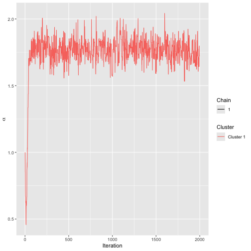
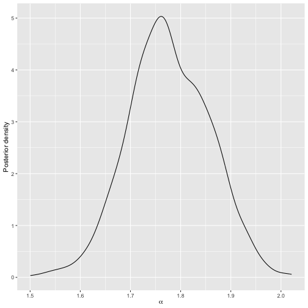
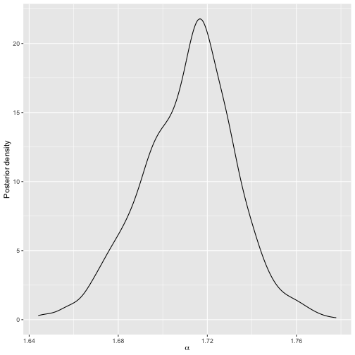
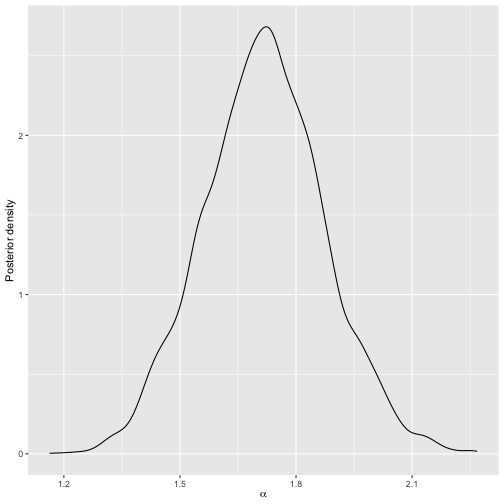
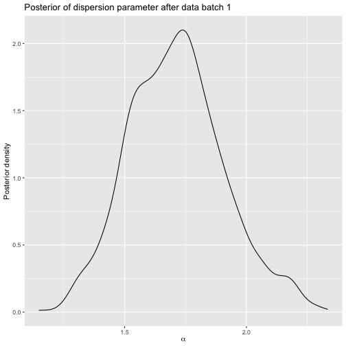
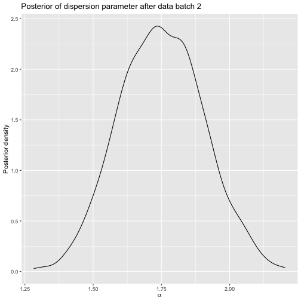

```r
library(BayesMallows)
library(ggplot2)
set.seed(123)
```


This vignette describes sequential Monte Carlo (SMC) algorithms to provide updated approximations to the posterior distribution of a single Mallows model. We consider scenarios where we receive sequential information in the form of complete rankings, partial rankings and updated rankings from existing individuals who have previously provided a (partial) ranking. This vignette focuses on the code. For an in-depth treatment of the implemented methodology, see @steinSequentialInferenceMallows2023 which is available <a href="https://eprints.lancs.ac.uk/id/eprint/195759/" target="_blank">here</a>. 


## New users with complete rankings

We use the `sushi_rankings` dataset to illustrate the methodology [@kamishima2003nantonac]. This dataset contains 5000 complete rankings for 10 sushi dishes.


```r
head(sushi_rankings)
#>      shrimp sea eel tuna squid sea urchin salmon roe egg fatty tuna tuna roll cucumber roll
#> [1,]      2       8   10     3          4          1   5          9         7             6
#> [2,]      1       8    6     4         10          9   3          5         7             2
#> [3,]      2       8    3     4          6          7  10          1         5             9
#> [4,]      4       7    5     6          1          2   8          3         9            10
#> [5,]      4      10    7     5          9          3   2          8         1             6
#> [6,]      4       6    2    10          7          5   1          9         8             3
```

The SMC methodology is designed for the case where date arrive in batches. Assume that we initially have only 300 observed rankings, in `data_batch1`:


```r
data_batch1 <- sushi_rankings[1:300, ]
```

We estimate a model on these data using `compute_mallows()`, which runs a full Metropolis-Hastings algorithm.


```r
model1 <- compute_mallows(data = setup_rank_data(data_batch1))
```

We assess convergence, and find that 300 is an appropriate burnin value.


```r
assess_convergence(model1)
```

<div class="figure">

<p class="caption">Trace plot for SMC model.</p>
</div>


```r
burnin(model1) <- 300
```

Having saved this model, assume we receive another batch of preferences at a later timepoint, with an additional 300 rankings.


```r
data_batch2 <- sushi_rankings[301:600, ]
```

We can now update the initial model, without rerunning the full Metropolis-Hastings algorithm, by calling `update_mallows()`. This function uses the sequential Monte Carlo algorithm of @steinSequentialInferenceMallows2023, and extracts a thinned sample of size `n_particles` from `model1` as initial values.


```r
model2 <- update_mallows(
  model = model1, 
  new_data = setup_rank_data(data_batch2), 
  smc_options = set_smc_options(n_particles = 1000))
```

All the posterior summary methods can be used for `model2`. For example, we can plot the posterior of $\alpha$.


```r
plot(model2)
```

<div class="figure">

<p class="caption">Posterior distribution of scale parameter for model 2.</p>
</div>

And we can plot the posterior of the latent ranks of selected items:


```r
plot(model2, parameter = "rho", items = c("shrimp", "sea eel", "tuna"))
```

<div class="figure">

<p class="caption">Posterior distribution of selected latent rankings for model 2.</p>
</div>


Next, assume we get yet another set of rankings later, now of size 1000.


```r
data_batch3 <- sushi_rankings[601:1600, ]
```

We can re-update the model.


```r
model3 <- update_mallows(model2, new_data = setup_rank_data(data_batch3))
```

We can again plot posterior quantities, and the plots reveal that as expected, the posterior uncertainty about the rankings has decreased once we added more data.


```r
plot(model3, parameter = "rho", items = c("shrimp", "sea eel", "tuna"))
```

<div class="figure">

<p class="caption">Posterior distribution of selected latent rankings for model 3.</p>
</div>

Finally, we add a batch with the last data and re-update the model.


```r
data_batch4 <- sushi_rankings[1601:5000, ]
model4 <- update_mallows(
  model3, 
  new_data = setup_rank_data(rankings = data_batch4))
```

The posterior uncertainty is now very small:


```r
plot(model4, parameter = "rho", items = c("shrimp", "sea eel", "tuna"))
```

<div class="figure">

<p class="caption">Posterior distribution of selected latent rankings for model 4.</p>
</div>


Below is a comparison of the posterior intervals of the dispersion parameter for each model. Note how the intervals get increasingly narrower as more data is added.


```r
rbind(
  compute_posterior_intervals(model1),
  compute_posterior_intervals(model2), 
  compute_posterior_intervals(model3),
  compute_posterior_intervals(model4)
)
#>   parameter  mean median          hpdi central_interval
#> 1     alpha 1.768  1.766 [1.603,1.917]    [1.604,1.922]
#> 2     alpha 1.777  1.773 [1.630,1.935]    [1.620,1.931]
#> 3     alpha 1.753  1.756 [1.676,1.827]    [1.677,1.827]
#> 4     alpha 1.712  1.714 [1.667,1.748]    [1.669,1.752]
```

As an assurance that the implementation is correct, we can compare the final model to what we get by running `compute_mallows` on the complete dataset:


```r
mod_bmm <- compute_mallows(
  data = setup_rank_data(rankings = sushi_rankings),
  compute_options = set_compute_options(nmc = 5000, burnin = 1000)
  )
```

We can compare the posteriors for $\alpha$ of the two models. Note that although both are rather wiggly, they agree very well about location and scale.


```r
plot(mod_bmm)
```

<div class="figure">

<p class="caption">Posterior distribution of scale parameter for Metropolis-Hastings run on the complete data.</p>
</div>


```r
plot(model4)
```

<div class="figure">

<p class="caption">Posterior distribution of scale parameter for model 4.</p>
</div>

The posterior intervals are also in good agreement.


```r
rbind(
  compute_posterior_intervals(mod_bmm),
  compute_posterior_intervals(model4)
)
#>   parameter  mean median          hpdi central_interval
#> 1     alpha 1.691  1.690 [1.648,1.734]    [1.643,1.732]
#> 2     alpha 1.712  1.714 [1.667,1.748]    [1.669,1.752]
```

The cumulative probability consensus is also in good agrement:


```r
compute_consensus(model4)
#>      cluster ranking          item cumprob
#> 1  Cluster 1       1    fatty tuna   1.000
#> 2  Cluster 1       2    salmon roe   1.000
#> 3  Cluster 1       3          tuna   1.000
#> 4  Cluster 1       4        shrimp   1.000
#> 5  Cluster 1       5       sea eel   1.000
#> 6  Cluster 1       6     tuna roll   0.835
#> 7  Cluster 1       7         squid   1.000
#> 8  Cluster 1       8    sea urchin   1.000
#> 9  Cluster 1       9           egg   1.000
#> 10 Cluster 1      10 cucumber roll   1.000
compute_consensus(mod_bmm)
#>      cluster ranking          item cumprob
#> 1  Cluster 1       1    fatty tuna       1
#> 2  Cluster 1       2    sea urchin       1
#> 3  Cluster 1       3          tuna       1
#> 4  Cluster 1       4    salmon roe       1
#> 5  Cluster 1       5        shrimp       1
#> 6  Cluster 1       6       sea eel       1
#> 7  Cluster 1       7     tuna roll       1
#> 8  Cluster 1       8         squid       1
#> 9  Cluster 1       9           egg       1
#> 10 Cluster 1      10 cucumber roll       1
```


## New users with partial or complete rankings

The functionality extends directly to partial ranks, including both top-$k$ rankings and rankings missing at random. At the moment, pairwise preferences are not supported, but this will be added in the future.

For this demonstration we shall assume that we can only observe the top-5 ranked items from each user in the `sushi_rankings` dataset.


```r
data_partial <- sushi_rankings
data_partial[data_partial > 5] <- NA
head(data_partial)
#>      shrimp sea eel tuna squid sea urchin salmon roe egg fatty tuna tuna roll cucumber roll
#> [1,]      2      NA   NA     3          4          1   5         NA        NA            NA
#> [2,]      1      NA   NA     4         NA         NA   3          5        NA             2
#> [3,]      2      NA    3     4         NA         NA  NA          1         5            NA
#> [4,]      4      NA    5    NA          1          2  NA          3        NA            NA
#> [5,]      4      NA   NA     5         NA          3   2         NA         1            NA
#> [6,]      4      NA    2    NA         NA          5   1         NA        NA             3
```

Again, assume we start out with a batch of data, this time with 100 rankings:


```r
data_batch1 <- data_partial[1:100, ]
```

We estimate this model using `compute_mallows()`. Since there are `NA`s in the data, `compute_mallows()` will run imputation over the missing ranks.


```r
model1 <- compute_mallows(
  data = setup_rank_data(data_batch1),
  compute_options = set_compute_options(nmc = 10000)
  )
```

The trace plot shows that convergence is reached quickly.


```r
assess_convergence(model1)
```

<div class="figure">

<p class="caption">Trace plot for SMC model.</p>
</div>

We set the burnin to 300.


```r
burnin(model1) <- 300
```

Below is the posterior for $\alpha$ after this initial run:


```r
plot(model1)
```

<div class="figure">

<p class="caption">Posterior distribution of scale parameter after initial run.</p>
</div>

Next, assume we receive 100 more top-5 rankings:


```r
data_batch2 <- data_partial[101:200, ]
```

We now update the initial model, using SMC. By default, a uniform distribution is used to propose new values of augmented ranks. The pseudo-likelihood proposal developed in @steinSequentialInferenceMallows2023 can be used instead, by setting `aug_method = "pseudo"` in the call to `set_compute_options()`, and we do this here.


```r
model2 <- update_mallows(
  model = model1, 
  new_data = setup_rank_data(data_batch2), 
  smc_options = set_smc_options(n_particles = 1000),
  compute_options = set_compute_options(
    aug_method = "pseudo", pseudo_aug_metric = "footrule")
  )
```

Below is the posterior for $\alpha$:


```r
plot(model2)
```

<div class="figure">

<p class="caption">Posterior distribution of scale parameter after updating the model based on new rankings.</p>
</div>


When even more data arrives, we can update the model again. For example, assume we now get a set of complete rankings, with no missingness:


```r
data_batch3 <- sushi_rankings[201:300, ]
```

We update the model just as before:


```r
model3 <- update_mallows(model2, new_data = setup_rank_data(data_batch3))
```


```r
plot(model3)
```

<div class="figure">

<p class="caption">Posterior distribution of scale parameter after updating the model based on new rankings.</p>
</div>


## Users updating their rankings

Another setting supported is when existing users update their partial rankings. For example, users can initially give top-5 rankings, and subsequently update these to top-10 rankings, top-20 rankings, etc. Another setting is when there are ranks missing at random, and the users subsequently provide these rankings. 

The main methodological issue in this case, is that the augmented rankings at the previous SMC timepoint may be in conflict with the new rankings. In this case, the augmented rankings must be corrected, as described in Chapter 6 of @steinSequentialInferenceMallows2023. We provide an example again with the sushi data.

We assume that the initial batch of data contains top-3 rankings provided by the first 100 users.


```r
set.seed(123)
sushi_reduced <- sushi_rankings[1:100, ]
data_batch1 <- ifelse(sushi_reduced > 3, NA_real_, sushi_reduced)
```

To keep track of existing users updating their preferences, we also need a user ID in this case. Currently, this is implemented by providing row names to the ranking matrix.


```r
rownames(data_batch1) <- seq_len(nrow(data_batch1))
head(data_batch1)
#>   shrimp sea eel tuna squid sea urchin salmon roe egg fatty tuna tuna roll cucumber roll
#> 1      2      NA   NA     3         NA          1  NA         NA        NA            NA
#> 2      1      NA   NA    NA         NA         NA   3         NA        NA             2
#> 3      2      NA    3    NA         NA         NA  NA          1        NA            NA
#> 4     NA      NA   NA    NA          1          2  NA          3        NA            NA
#> 5     NA      NA   NA    NA         NA          3   2         NA         1            NA
#> 6     NA      NA    2    NA         NA         NA   1         NA        NA             3
```


We fit the standard Metropolis-Hastings algorithm to these data, yielding a starting point.


```r
mod_init <- compute_mallows(
  data = setup_rank_data(
    rankings = data_batch1,
    user_ids = rownames(data_batch1))
)
```

Convergence seems to be quick, and we set the burnin to 300.


```r
assess_convergence(mod_init)
```

<div class="figure">

<p class="caption">Trace plot for initial run on sushi batch 1.</p>
</div>

```r
burnin(mod_init) <- 300
```

Next, assume we receive top-5 rankings from the same users. We now update the model using SMC.


```r
data_batch2 <- ifelse(sushi_reduced > 5, NA_real_, sushi_reduced)
rownames(data_batch2) <- seq_len(nrow(data_batch2))
model2 <- update_mallows(
  model = mod_init, 
  new_data = setup_rank_data(
    rankings = data_batch2, user_ids = rownames(data_batch2)),
  compute_options = set_compute_options(
    aug_method = "pseudo", pseudo_aug_metric = "footrule")
  )
```

We can plot the posterior distributions of $\alpha$ before and after.


```r
plot(mod_init) + ggtitle("Posterior of dispersion parameter after data batch 1")
```

<div class="figure">

<p class="caption">Posterior after sushi batch 1.</p>
</div>


```r
plot(model2) + ggtitle("Posterior of dispersion parameter after data batch 2")
```

<div class="figure">

<p class="caption">Posterior after sushi batch 2.</p>
</div>

Next, assume we receive top-8 rankings from the same users. 


```r
data_batch3 <- ifelse(sushi_reduced > 8, NA_real_, sushi_reduced)
rownames(data_batch3) <- seq_len(nrow(data_batch3))
```

Before proceeding, it is instructive to study why this situation needs special care. Below are the augmented rankings for user 1 in particle 1:


```r
(v1 <- model2$augmented_rankings[, 1, 1])
#>  [1]  2  9  6  3  4  1  5 10  8  7
```

Next, we show the data provided by user 1 in `data_batch3`:


```r
(v2a <- unname(data_batch3[1, ]))
#>  [1]  2  8 NA  3  4  1  5 NA  7  6
```

By comparing the non-missing ranks, we can check if they are consistent or not:


```r
(v2b <- v2a[!is.na(v2a)])
#> [1] 2 8 3 4 1 5 7 6
v1[v1 %in% v2b]
#> [1] 2 6 3 4 1 5 8 7
all(v1[v1 %in% v2b] == v2b)
#> [1] FALSE
```

The provided data are not consistent with the augmented rankings in this case. This means that the augmented rankings for user 1 in particle 1 need to be corrected by the algorithm.

Luckily, this happens automatically in our implementation, so we can update the model again.


```r
model3 <- update_mallows(
  model = mod_init, 
  new_data = setup_rank_data(
    rankings = data_batch3, user_ids = rownames(data_batch3)))
```

Next we plot the posterior:


```r
plot(model3) + ggtitle("Posterior of dispersion parameter after data batch 3")
```

<div class="figure">

<p class="caption">Posterior after sushi batch 3.</p>
</div>

Now assume we get a batch of new users, without missing ranks. These can be treated just as the other ones, but we need new user IDs.


```r
data_batch4 <- sushi_rankings[500:600, ]
rownames(data_batch4) <- as.character(500:600)
head(data_batch4)
#>     shrimp sea eel tuna squid sea urchin salmon roe egg fatty tuna tuna roll cucumber roll
#> 500      6       5    4     8          2          3   7          1         9            10
#> 501      3       9    5     8          4          2   6          1         7            10
#> 502      3       1    8     5          4          7   9          2         6            10
#> 503      8       6    3     1          4          5   9          7         2            10
#> 504      4       7    1     2          9         10   3          8         5             6
#> 505      1       5    6     8          3          4   9          2         7            10
```


```r
model4 <- update_mallows(
  model = model3, 
  new_data = setup_rank_data(
    rankings = data_batch4, user_ids = rownames(data_batch4)))
```

Here is the posterior for this model.


```r
plot(model4) + ggtitle("Posterior of dispersion parameter after data batch 4")
```

<div class="figure">

<p class="caption">Posterior after sushi batch 4.</p>
</div>

We can confirm that the implementation is sensible by giving the complete data to `compute_mallows`:


```r
full_data <- rbind(data_batch3, data_batch4)
mod_bmm <- compute_mallows(data = setup_rank_data(rankings = full_data))
```


The trace plot indicates good convergence, and we set the burnin to 300.


```r
assess_convergence(mod_bmm)
```

<div class="figure">

<p class="caption">Trace plot for MCMC run on sushi data.</p>
</div>

```r
burnin(mod_bmm) <- 300
```

We see that the posterior is close to the one of `model4`:


```r
plot(mod_bmm)
```

<div class="figure">

<p class="caption">Posterior for MCMC on sushi data.</p>
</div>


## References
