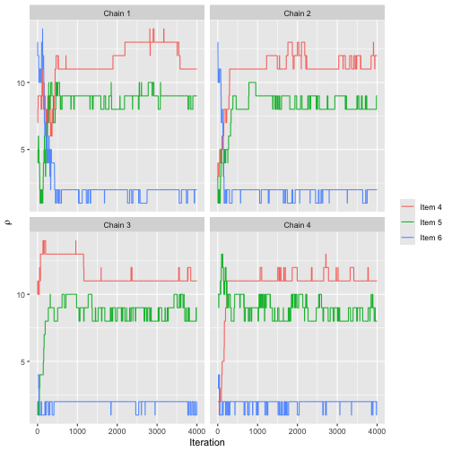
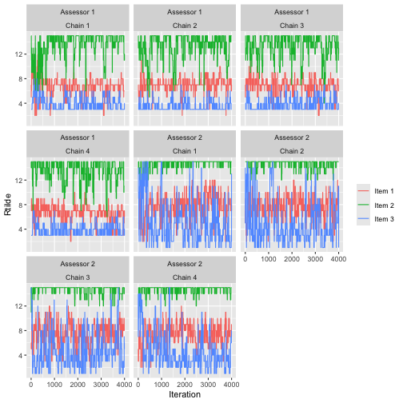
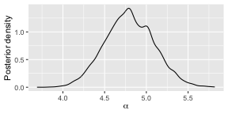
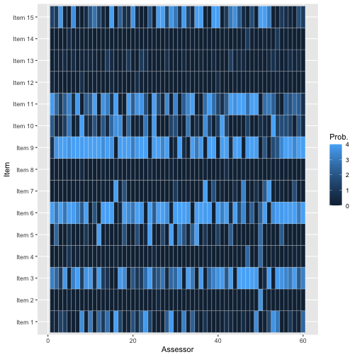

```r
library(BayesMallows)
set.seed(123)
```

This vignette describes how to run Markov chain Monte Carlo with parallel chains. For an introduction to the "BayesMallows" package, please see [the introductory vignette](https://ocbe-uio.github.io/BayesMallows/articles/BayesMallows.html), which is an updated version of @sorensen2020. For parallel processing of particles with the sequential Monte Carlo algorithm of @steinSequentialInferenceMallows2023, see the [SMC vignette](https://ocbe-uio.github.io/BayesMallows/articles/SMC-Mallows.html).


## Why Parallel Chains?

Modern computers have multiple cores, and on computing clusters one can get access to hundreds of cores easily. By running Markov Chains in parallel on $K$ cores, ideally from different starting points, we achieve at least the following:

1. The time you have to wait to get the required number of post-burnin samples scales like $1/K$.

2. You can check convergence by comparing chains.


## Parallel Chains with Complete Rankings

In "BayesMallows" we use the "parallel" package for parallel computation. Parallelization is obtained by starting a cluster and providing it as an argument. Note that we also give one initial value of the dispersion parameter $\alpha$ to each chain.


```r
library(parallel)
cl <- makeCluster(4)
fit <- compute_mallows(
  data = setup_rank_data(rankings = potato_visual), 
  compute_options = set_compute_options(nmc = 5000),
  cl = cl
)
stopCluster(cl)
```

We can assess convergence in the usual way:


```r
assess_convergence(fit)
```


We can also assess convergence for the latent ranks $\boldsymbol{\rho}$. Since the initial value of $\boldsymbol{\rho}$ is sampled uniformly, the two chains automatically get different initial values.


```r
assess_convergence(fit, parameter = "rho", items = 1:3)
```


Based on the convergence plots, we set the burnin to 3000. 


```r
burnin(fit) <- 3000
```

We can now use all the tools for assessing the posterior distributions as usual. The post-burnin samples for all parallel chains are simply combined, as they should be.

Below is a plot of the posterior distribution of $\alpha$.


```r
plot(fit)
```


Next is a plot of the posterior distribution of $\boldsymbol{\rho}$.


```r
plot(fit, parameter = "rho", items = 4:7)
```


## Parallel Chains with Pairwise Preferences


A case where parallel chains might be more strongly needed is with incomplete data, e.g., arising from pairwise preferences. In this case the MCMC algorithm needs to perform data augmentation, which tends to be both slow and sticky. We illustrate this with the beach preference data, again referring to @sorensen2020 for a more thorough introduction to the aspects not directly related to parallelism.


```r
beach_data <- setup_rank_data(preferences = beach_preferences)
```

We run four parallel chains, letting the package generate random initial rankings, but again providing a vector of initial values for $\alpha$.


```r
cl <- makeCluster(4)
fit <- compute_mallows(
  data = beach_data,
  compute_options = set_compute_options(nmc = 4000, save_aug = TRUE),
  initial_values = set_initial_values(alpha_init = runif(4, 1, 4)),
  cl = cl
)
stopCluster(cl)
```

### Trace Plots

The convergence plots shows some long-range autocorrelation, but otherwise it seems to mix relatively well.


```r
assess_convergence(fit)
```


Here is the convergence plot for $\boldsymbol{\rho}$:


```r
assess_convergence(fit, parameter = "rho", items = 4:6)
```



To avoid overplotting, it's a good idea to pick a low number of assessors and chains. We here look at items 1-3 of assessors 1 and 2.


```r
assess_convergence(fit,
  parameter = "Rtilde",
  items = 1:3, assessors = 1:2
)
```



### Posterior Quantities

Based on the trace plots, the chains seem to be mixing well. We set the burnin to 1000.


```r
burnin(fit) <- 1000
```

We can now study the posterior distributions. Here is the posterior for $\alpha$. Note that by increasing the `nmc` argument to `compute_mallows` above, the density would appear smoother. In this vignette we have kept it low to reduce the run time.


```r
plot(fit)
```



We can also look at the posterior for $\boldsymbol{\rho}$.


```r
plot(fit, parameter = "rho", items = 6:9)
```


We can also compute posterior intervals in the usual way:


```r
compute_posterior_intervals(fit, parameter = "alpha")
#>   parameter  mean median          hpdi central_interval
#> 1     alpha 4.798  4.793 [4.242,5.373]    [4.235,5.371]
```


```r
compute_posterior_intervals(fit, parameter = "rho")
#>    parameter    item mean median    hpdi central_interval
#> 1        rho  Item 1    7      7     [7]            [6,7]
#> 2        rho  Item 2   15     15    [15]          [14,15]
#> 3        rho  Item 3    3      3   [3,4]            [3,4]
#> 4        rho  Item 4   11     11 [11,13]          [11,13]
#> 5        rho  Item 5    9      9  [8,10]           [8,10]
#> 6        rho  Item 6    2      2   [1,2]            [1,2]
#> 7        rho  Item 7    9      8  [8,10]           [8,10]
#> 8        rho  Item 8   12     12 [11,13]          [11,14]
#> 9        rho  Item 9    1      1   [1,2]            [1,2]
#> 10       rho Item 10    6      6   [5,6]            [5,7]
#> 11       rho Item 11    4      4   [3,5]            [3,5]
#> 12       rho Item 12   13     13 [12,14]          [11,14]
#> 13       rho Item 13   10     10  [8,10]           [8,10]
#> 14       rho Item 14   13     14 [12,14]          [12,14]
#> 15       rho Item 15    5      5   [4,5]            [4,6]
```

And we can compute the consensus ranking:


```r
compute_consensus(fit)
#>      cluster ranking    item   cumprob
#> 1  Cluster 1       1  Item 9 0.8691667
#> 2  Cluster 1       2  Item 6 1.0000000
#> 3  Cluster 1       3  Item 3 0.6391667
#> 4  Cluster 1       4 Item 11 0.9404167
#> 5  Cluster 1       5 Item 15 0.9559167
#> 6  Cluster 1       6 Item 10 0.9636667
#> 7  Cluster 1       7  Item 1 1.0000000
#> 8  Cluster 1       8  Item 7 0.5473333
#> 9  Cluster 1       9  Item 5 0.9255833
#> 10 Cluster 1      10 Item 13 1.0000000
#> 11 Cluster 1      11  Item 4 0.6924167
#> 12 Cluster 1      12  Item 8 0.7833333
#> 13 Cluster 1      13 Item 12 0.6158333
#> 14 Cluster 1      14 Item 14 0.9958333
#> 15 Cluster 1      15  Item 2 1.0000000
```


```r
compute_consensus(fit, type = "MAP")
#>      cluster map_ranking    item probability
#> 1  Cluster 1           1  Item 9   0.2683333
#> 2  Cluster 1           2  Item 6   0.2683333
#> 3  Cluster 1           3  Item 3   0.2683333
#> 4  Cluster 1           4 Item 11   0.2683333
#> 5  Cluster 1           5 Item 15   0.2683333
#> 6  Cluster 1           6 Item 10   0.2683333
#> 7  Cluster 1           7  Item 1   0.2683333
#> 8  Cluster 1           8  Item 7   0.2683333
#> 9  Cluster 1           9  Item 5   0.2683333
#> 10 Cluster 1          10 Item 13   0.2683333
#> 11 Cluster 1          11  Item 4   0.2683333
#> 12 Cluster 1          12  Item 8   0.2683333
#> 13 Cluster 1          13 Item 12   0.2683333
#> 14 Cluster 1          14 Item 14   0.2683333
#> 15 Cluster 1          15  Item 2   0.2683333
```

We can compute the probability of being top-$k$, here for $k=4$:


```r
plot_top_k(fit, k = 4)
```




# References
